## 一些tips
- 编译单元(translation unit)：一个单独的文件，例如cpp
- 使用sizeof(数据类型)可以得到对应数据类型的大小(以字节为单位)
- `#pragma once`：被称为 **头文件保护符（"header guard"）**，防止我们将单一头文件多次include到单一编译单元中；或者多个文件会include一个头文件，然后最后的main文件又会将这些文件全部include导致出现多次include；
  - 有另外一种头文件保护符，如下所示:
    - 首先判断_LOG_H是否已经被包含在里面，若没有则复制下面的代码；否则直接跳过；
    - 然后，将该文件定义为LOG_H
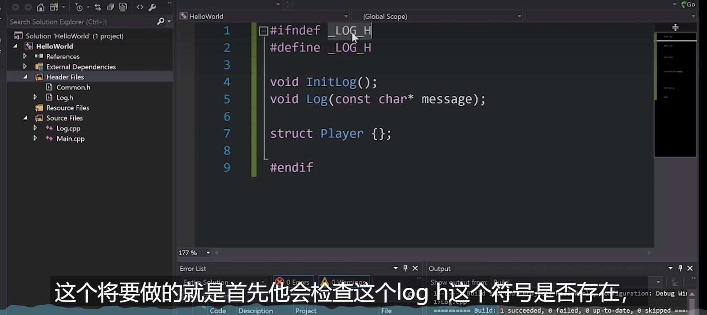
- #include的文件如果有.h后缀则属于c标准库，若没有则属于c++
- `else if`其实并不是关键字，而是以下的缩写（但还是会有点问题，比如再往后写else就没有对应的if，这个可以在该else中嵌套else 也许能解决）
    ```
    else
    {
        if() {}
    }
    ```
- 下列三个均为筛选器，而不是真正的文件夹，是以虚拟文件夹的形式来组织代码


- 由于VS本身会将编译时生成的文件放到项目文件夹下的Debug文件夹中；而最终生成的exe文件则会放到与.sln同级的Debug文件夹中，查看比较麻烦，可以在下面的设置中更改路径存到指定的文件夹中，并可以区别不同平台以及Debug模式或Release模式
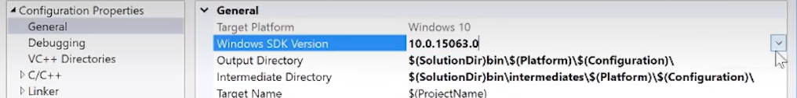

- c++11中使用char类定义字符串必须要定义成以下形式`const char* message`，不能省略`const`；双引号的类型是const char*，而单引号才是char；如果想创建char[]来存储字符串，必须要多申请一个空间用来存储空终止符0,例如:`char[5] = {'N', 'a', 'm', 'e', 0};`

- 字符串字面值(string literals)：实际是双引号之间的内容，例如
`"name"`；只存在于只读内存中

- 几种不同的char
    ```
    const char* name = u8"name";    //也可以省略u8,8bit
    const wchar_t* name1 = L"name"; //宽字符,根据编译器不同
                                    //可能是8bit、16bit、32bit
                                    //windows上16bit
                                    //linux上32bit
    //c++11引入
    const char16_t* name2 = u"name";    //16bit
    const char32_t* name3 = U"name";    //32bit
    ```

- string进行字符串字面值相加时，只能有一个是字符串字面值
    ```
    //std::string name = "name" + "hello";    //报错
    //std::string name = std::string("name") + "hello";   //成功

    //或者
    using namespace std::string_literals;
    std::string name = "name"s + "hello";

    //或者
    //R忽略转义符，即使加入\n，也会一起打印出来
    const char* name = R"(Line1         //输出：Line1
    Line2                                       Line2
    Line3)"；                                   Line3

    //想换行必须加入\n
    const char* name1 = "Line1\n"       //输出：Line1
        "Line2\n"                               Line2
        "Line3"\n;                              Line3
    ```
- 范围循环其实是迭代器循环访问的缩写；例如
    ```
    for(auto value : values) {}
    //相当于
    for(std::vector<int>::iterator it = values.begin(); it != values.end(); ++it) {}
    ```

- 在对数组或其他数据结构进行访问时，可以采用[]或.at()访问
    - 对于std::vector这类容器而言，[]不会进行边界检查，如果访问超出边界则会出现未定义行为，而.at()则会进行边界检查，若越界则抛出std::out_of_range异常
    - 对于std::unordered_map这样的关联容器，[]可以直接进行访问，如果该键值不存在则会自动创建一个具有该键的默认元素；并且无法对const对象使用，因为返回的都是引用；而.at()则会在访问键值不存在时抛出std::out_of_range异常，并且其可以对const对象使用


## 预处理
- 包含`#include, #define, #if, #endif`，其本质都是将对应的文件内容复制到对应位置；
例如：有两个文件`EnBranch.h`和`Math.cpp`
- `#if`可以让我们根据特定条件包含或剔除代码
    ```
    //EnBranch.h
    }

    //Math.cpp
    #define INTEGER x

    #if 0           //为0时，则这一部分代码不会进行编译，为1则正常编译
    INTEGER multiply(int a, int b) //生成的预处理文件.i中就会把INTE替换成x
    {
        INTEGER result = a * b;
        return result;
    #include"EnBranch.h"    //此处就是把EnBranch.h的内容复制过来，即'}'
    #endif
    ```
- 修改如下设置便可以生成.i文件(生成了.i文件后边不后悔生成.obj文件 **(.obj文件内容是01机器码)**；.i文件如下图二和三所示)
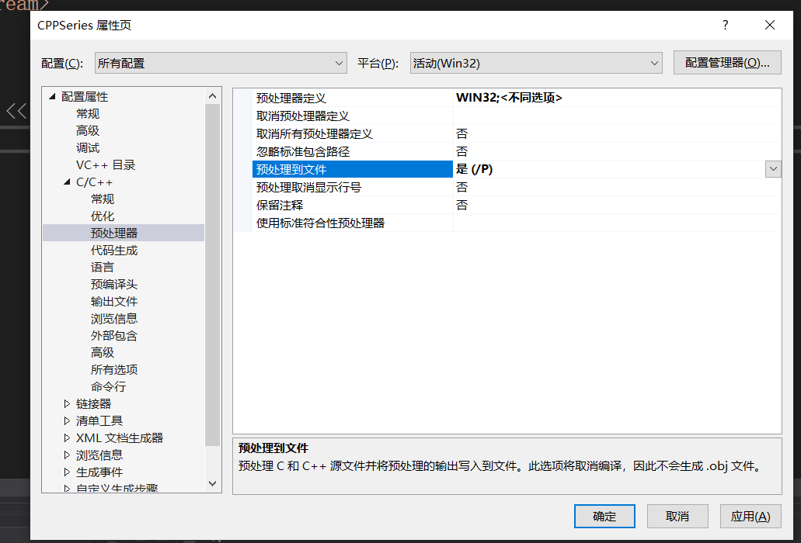
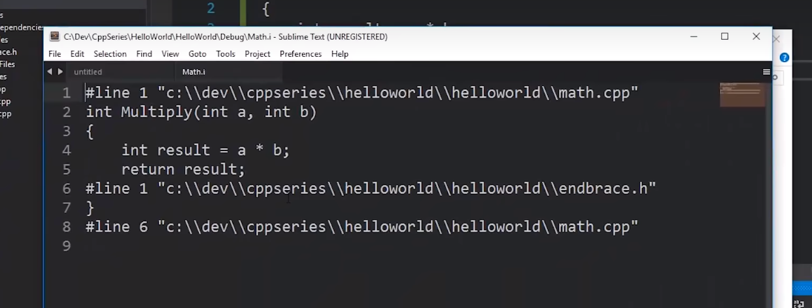
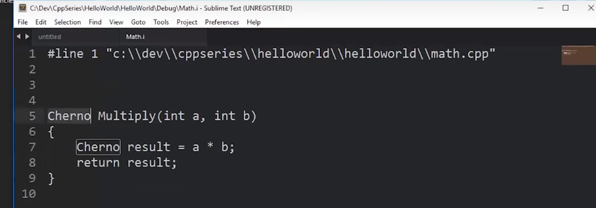
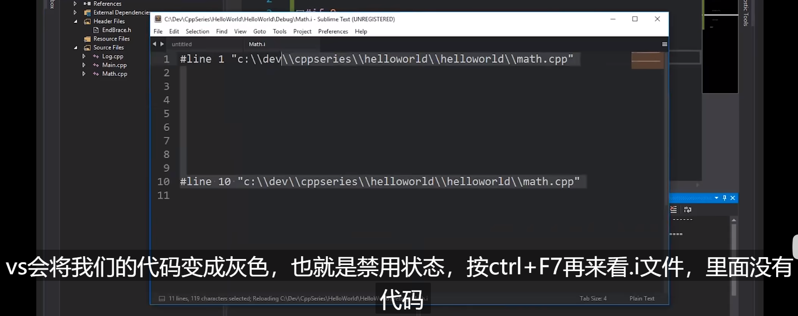
- 修改如下设置，获得.asm文件得到汇编代码，默认debug模式下会插入很多代码便于进行debug，但是会延长程序运行时间
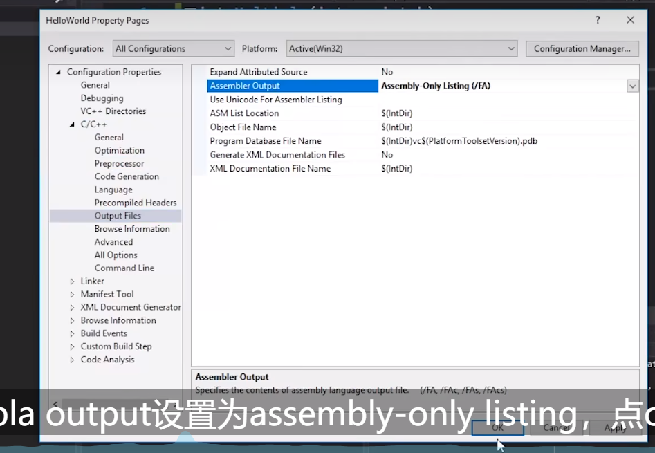
- 在debug模式下设置为速度最优策略，会得到简洁的汇编代码，但是编译时会发生错误，需要进行相应设置(下图二)
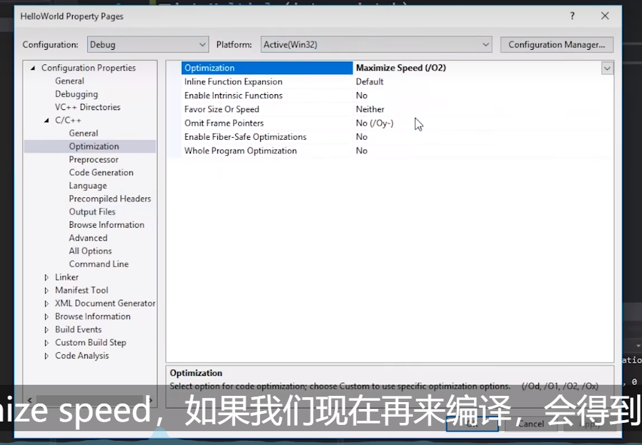
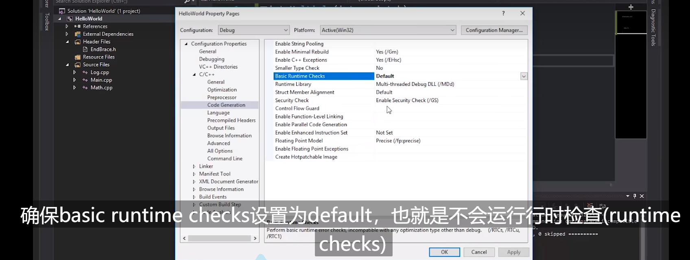

## 链接(Linking)
- 每一个cpp文件在编译后都会生成.obj文件，然后将他们链接成.exe文件
- 每一个.exe文件必须要有一个入口函数，这个函数不一定非要是main函数，可以自定义，如下所示 **（入口点）**：
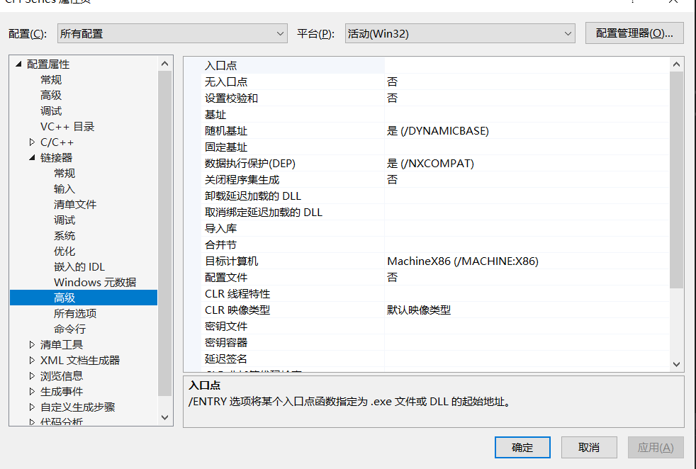
- **未解析的外部符号(unresolved external symbol):**
  
  `Log.cpp`中的Log函数被更换为Logr函数，导致Linker在进行链接时无法找到`Math.cpp`中`Multiply`函数调用的`Log`函数，从而导致链接失败
  - 如果在`Multiply`前面加上`static`，哪怕main函数中并没有调用该函数，仍然会报错；这是因为虽然在此处并没有被调用，在其他文件中也存在被调用的可能，所以Linker仍然会进行链接
  - 而加入`static`之后， 该函数只能够在`Math.cpp`文件中被调用，但是实际并没有被调用，所以不会报错
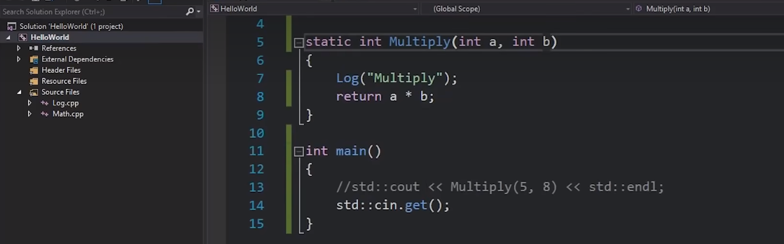

- **重复符号报错**：

    有相同的函数，相同返回值，相同参数列表；Linker就不知道该链接到哪个函数上，分为两种情况：
- 在同一个编译单元中存在完全相同的函数、返回值和参数列表，此时，编译器会直接帮我们检测出来
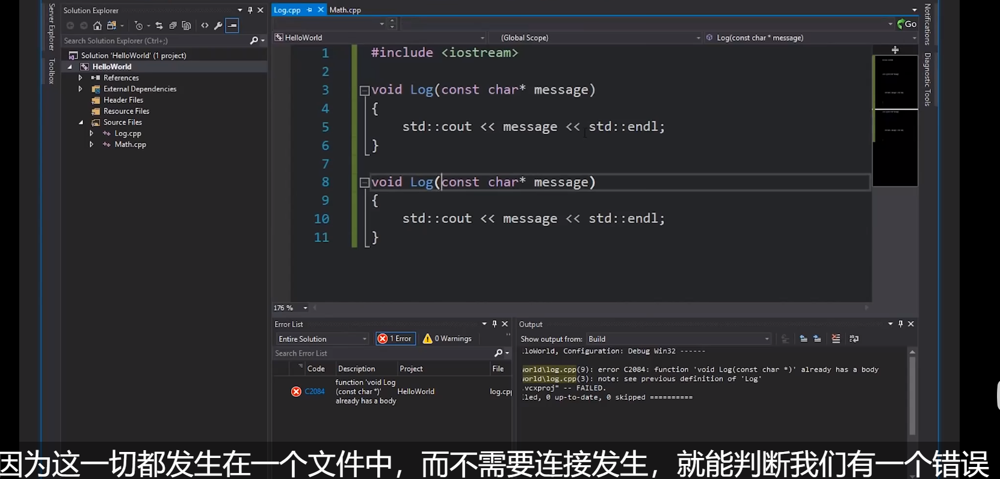
- 如果在不同编译单元有相同的函数、返回值和参数，此时，编译器无法查出错误，会被正确编译。但是当链接时，则会报错
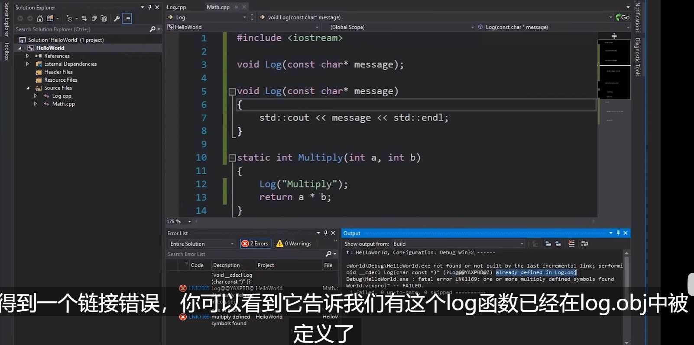
- 或者，函数定义被写在`Log.h`中，然后存在多个文件同时调用该头文件。而`#inlcude`的逻辑就是把头文件中的代码全部复制到对应文件中，则会导致函数在两个文件中被同时定义，情况就如上面那个错误相同，导致链接失败
  - 一种解决方法是，在头文件中对应函数定义加上修饰词`static`，此时在不同文件中创建的该函数仅自己文件可见，例如`Math.cpp`和`Log.cpp`同时`#include"Log.h"`，则会同时生成两个Log函数，但是这两个Log函数对对方cpp文件是不可见的。在`Math.cpp`中的Log函数，`Log.cpp`是不可见的，就不会导致重复定义。
  - 另一种是增加修饰词`inline`，当cpp文件包含该头文件时，只会将函数本体拿过去替换，而不是定义一个函数
    ```
    //Log.h
    void Log(const char* message)
    {
        std::cout << message << std::endl;
    }

    //Math.cpp
    #include "Log.h"
    int Multlpy (int a, int b)
    {
        //Log("Multlpy")
        std:: cout << "Multlpy" << std::endl;
        return a* b;
    }
    ```
  - 第三种解决方法，在头文件中仅放函数声明，在cpp文件中写函数定义
    ```
    //Log.h
    void Log(const char* message);

    //Log.cpp
    #include"Log.h"
    void Log(const char* message)
    {
        std::cout<< message << std::endl;
    }

    //Math.cpp
    #include"Log.h"
    int Multlpy(int a, int b)
    {
        Log("Multlpy);
        return a * b;
    }
    ```
- **静态链接**
  - 在生成exe时，便会在编译链接时将所有需要的文件包含到exe中
  - 在项目属性的c++常规的附加包含目录中，输入外部文件的头文件所在的路径
  - 在项目属性的链接器的输入中，输入外部文件的需要调用的.lib文件

- **动态链接**
  - 在运行的过程中才会调用.dll文件，这需要我们将.dll文件置于exe文件的同级目录下
  - 头文件是通用的，即无论是静态链接还是动态链接，都是用同一个头文件，因此只需要输入外部文件的头文件所在路径即可
  - 在项目属性的链接器的输入中，输入外部文件的需要调用的文件名中含有dll的.lib文件
  - 此时便可通过编译，但是无法运行，必须将需要调用的.dll文件置于.exe所在的文件夹之中

- **自建library与项目链接**
  - 首先创建一个项目`CPP_Series`，然后右键项目解决方案添加新项目`Engine`，这样就可以获得两个项目，新建的项目作为自建library，输出.lib文件，为项目静态链接提供文件
  - 在`Engine`中分别创建`Engine.h`和`Engine.cpp`；而在`CPP_Series`的main函数需要调用`Engine`；此时可以通过以下代码调用
    ```
    #include"../../Engine/src/Engine.h" //没有添加附加包含目录时的写法

    #include"Engine.h"  //添加附加包含目录后的写法

    //此时能够编译成功，但是无法运行，因为链接并没有成功

    //一种方法是，先编译Engine得到.lib文件，
    //然后需要在链接器常规的附加库目录中写入.lib文件所在的路径，
    //否则会报无法打开文件的错
    //采用上面所写的静态链接的方法输入需要调用的Engine.lib，
    //(实验发现，不写Engine.lib也能调用成功)

    //另一种方法是，使用VS自带的引用功能，
    //右键`CPP_Series`并选择添加模块中的引用模块，加入`Engine`
    //但是和视频不同，我仍然需要在附加库目录中写入.lib文件所在的路径，
    //否则会报无法打开.lib文件的错
    //这种方法的好处：不用关心实际生成.lib的文件名，
    //有时可能会更改文件名，导致重新添加
    //(但好像也没啥问题吧，上面的方法不就可以不写文件名了么 呃呃)
    //另外的好处就是，Engine成为了CPP_Series的依赖项，每次生成
    //CPP_Series时，会自动编译Engine生成对应的.lib文件
    int main()
    {
        Engine::PrintMessage();
    }
    ```

## 指针(pointer)
- **原始指针(raw pointer):**
  - 指针其实就是一个无符号整数，代表一个内存地址，前面的类型只是表明该内存地址中存储的数据的类型，与指针本身类型无关。
  - **`void* ptr = 0`**：0是地址，但是它不能够写入和读取，只是为了声明该指针为空，void代表完全没有类型，只是为了在进行写入和读取时告诉编译器需要申请多大的空间
  - `&变量`：取该变量的内存地址
    ```
    int value = 8;
    void* ptr = &value;
    *ptr = 10;  //会报错，因为编译器不知道要申请多少空间来存储10
                //这个数字;只需要将上面的代码改为int* ptr = &value
                //即可正常写入

    char* buffer = new char[8]; //向堆申请了8个字节空间，
                                //并将该空间的起始位置对应
                                //的地址赋给buffer
    memset(buffer, 0, 8);   //用0去填充申请的空间
    delete[] buffer;        //由于是从堆上申请的，需要手动释放
                            //因为申请的是数组，需要对应的delete[]
    ```
- **智能指针(smart pointer)**

    在调用new分配内存时，不用自己去调用delete，甚至可以不需要我们去new，本质是对原始指针的封装
  - unique_ptr
    - 作用域指针，当超出作用域会自动调用delete并销毁
    - 只能有一个指针指向某块内存，因为当多个unique_ptr指向同一内存时，若其中有一个指针销毁，则那块内存也会被delete，导致其他unique_ptr失效，因此不能复制unique_ptr
    - unique_ptr的构造函数是explicit的，只能显式调用，并且删除了拷贝构造函数，以及&引用
        ```
        class Entity
        {
        public:
            Entity()
            {
                std::cout << "created" << std::endl;
            }

            ~Entity()
            {
                std::cout << "destroyed" << std::endl;
            }
            
            void print() {}
        };


        int main()
        {
            //只能够显式调用，不能entity= new Entity();
            std::unique_ptr<Entity> entity(new Entity());
            //更好的实现方式，出于异常安全考虑，对unique_ptr很重要
            std::unique_ptr<Entity> entity1 = std::make_unique<Entity>();
            entity1->print();
        }
        ```
  - shared_ptr
    - 通过引用计数来判断是否调用delete并销毁，例如：有两个shared_ptr同时指向同一内存，则引用计数为2，当有指针销毁时，引用计数会减1，当引用计数为0时，调用delete并销毁
    - 会额外分配一块称为控制块的内存，用来存储引用计数
    - 如果先new然后给shared_ptr会产生两次内存分配，一次是Entity本身的内存分配，另一次是控制块内存的分配；若直接使用`make_shared<Entity>`则可以将这两次内存分配结合起来，效率更高
        ```
        int main()
        {
            std::shared_ptr<Entity> sharedentity = new Entity();
            std::shared_ptr<Entity> sharedentity1 = std::make_shared<Entity>();   //效率更高
            std::shared_ptr<Entity> e0 = entity1;   //可以复制
        }
        ```
  - weak_ptr
    - 基本和shared_ptr功能类似，但是把shared_ptr赋值给weak_ptr，并不会增加引用次数`std::weak_ptr<Entity> = sharedentity1;`
    - 可以用来判断底层对象是否还活着，但不能保证底层对象一直存活
- `->`操作符的用处：
  - 当存在指针，但是需要访问其内部变量时，可以简化代码，例如:`Entity* ptr = new Entity();   std::cout << ptr->m_Name`
  - 可以获取成员变量的偏移量，得到该类型的起始地址到该成员变量所在位置的偏移量
    ```
    struct Vector3
    {
        float x, y, z;  //float为4Bytes，所以偏移量分别为0,4,8
    }

    int offset = (int)&((Vector3*)nullptr)->x;   //offset=0
    int offset = (int)&((Vector3*)0)->x;    //offset = 0
    ```
## 引用(reference)
- 与指针不同，引用必须引用一个已经存在的变量，本身不是变量不会占用内存空间，相当与给被引用对象创建了别名

##类(class)与结构体(struct)的区别
- c++保留struct是为了对c有一定的兼容性
- 类默认私有，结构体默认公有
- 具体什么情况使用什么，根据个人观点而定。一般来说，struct用来存储一些简单的变量以及简单的方法，而class则实现一些较为复杂的东西以，继承用class更好

## Static
- 在类或结构体的外面，则代表该类或结构体在link阶段是局部的，只对定义它的编译单元可见
    ```
    //Static.cpp
    static int value = 5;

    //Main.cpp
    int value = 10; //编译通过，
                    //因为上面的value仅Static.obj文件可见
                    //若上面没有static修饰词，则编译失败，
                    //会提示link失败，因为该变量被定义了两次

    extern int value;   //上面没有static修饰词，该句代码会让编译器从其他编译单元里找到value的定义(external linking)，如果上面有static修饰词，则unresolved external symbol 链接失败

    ```
- 在类或结构体内部，代表这部分内容是所有实例所共享的
  - 静态方法和静态变量没有对应的实例，所以静态方法无法调用非静态变量
- **静态局部变量：**
  - 假设函数中存在一个静态局部变量，在第一次调用该函数时会初始化为0，然后在每次调用该函数后进行自增操作，则会一直增加；若不是static，则每次会进行初始化并自增
    ```
    void function()
    {
        static int value = 0;   //此时主函数会打印1,2,3,4,5
                                //若没static，则会打印5次1
                                //相较于直接将其设置为全局变量
                                //这么设置的value只有才function
                                //中才会进行操作
                                //其他函数无法访问value；
        value++;
        std::cout << value << std::endl;
    }

    int main()
    {
        for(int i = 0; i < 5; ++i)
        {
            function();
        }
    }
    ```

## 设计模式
**单例模式(singletons)**
- 仅创建一个实例，并其生命周期为整个程序
- 构造函数和析构函数不能够被外部访问，防止实例化，需要将这两个函数置于private
- 防止进行复制实例化，可以将拷贝构造函数删除
- 单例模式核心便是`Get()`，使用简化版，则只会在第一次调用该函数时实例化一个对象
- 使用namespace能够实现，但是namespace并没有public 和private等功能，同时也没有赋值给一个对象的能力
```
class Singleton
{
private:
    static Singleton* s_Instance;
public:
    static Singleton& Get()
    {
        return *s_Instance;
    }

    void Hello();
};

Singleton* Siongleton::s_Instance = nullptr;

int main()
{
    Singleton::Get().Hello();
}

//简化版，在Get函数中静态实例一个对象，就无需在其他CPP文件中做以下声明了`Singleton Singleton::s_Instance;`
class Singleton
{
public:
    Singleton(const Singleton&) = delete;   //删除拷贝构造函数

    static Singleton& Get()
    {
        static Singleton s_Instance;  //将其生命周期延长至程序结束
                                    //第一次调用会创建实例；之后不会
        return s_Instance;            //返回存在的唯一的一个实例
    }

    //能够使用Singleton.Hello()直接调用IHello()，
    //不需要Singleton::Get().IHello()，当然这边IHello不能直接访问
    //因为是private的
    static void Hello() { return Get().IHello(); }
private:
    void IHello();
};


int main()
{
    Singleton::Get().Hello();
    //或者
    Singleton& instance = Singleton::Get(); //必须使用引用
    instance.Hello();

}
```

## 枚举(enums)
- 一些值的集合，给一个值指定一个名称
- 实际就是整数的集合，默认是递增；例如定义A、B、C，则分别为0、1、2；
若定义A=2、B、C，则分别为2、3、4
    ```
    enum Example : unsigned char    //默认是int，但是可以设定类型(仅限整形，float、double不行)
    {
        A, B, C //其中A=0;B=1;C=2(默认状况下，都是进行递增)
                //也可以自己赋值：A=2
    };

    Example value = A;  //value只能是Example中的一个
    //Example value = 5； //会报错
    ```

## 类(class)
- **构造函数(constructor)**:
  - 会有默认构造函数
  - 可以进行函数重载
  - 当不需要默认构造函数时，可以`class_name() = delete`
  - 直接调用类内静态函数或变量时，构造函数并不会被调用
- **析构函数(destructor)**：
  - 对象生命周期结束后(销毁后)自动调用
  - 可以用来释放申请的内存空间
- **继承(inheritance)**
  - 会继承父类的所有东西包括变量和函数
  - `class sub_class_name : public bas_class_name {};`
- **虚函数(virtual function)**
  - 问题来源：在类中正常声明函数，当调用这个函数时，总会去调用属于这个类型的函数
  - 虚函数引入了要动态分配的东西，因此引入了虚表(vtable)的概念用来编译，其中包含了类中所有虚函数映射列表 **(即想重写一个函数，必须把基类中的原函数设为虚函数，同时在子类的重写的那个函数后面加上override(c++11标准允许加入override标记)提高代码可读性)**
  - 会有内存开销，需要用来存储虚表，基类中有一个指针专门指向虚表；吗，每次调用虚函数都需要去遍历虚表，带来性能损失(但是其实影响很小)

    ```
    class Entity
    {
    public:
        //修改前的方法
        std::string GetName() {return "Entity";}

        ////修改后的方法，
        //virtual std::string GetName() {return "Entity";}
    }


    class Player : public Entity
    {
    private:
        std::string m_Name;
    public:
        Player(std::string Name)
            : m_Name(Name) {}
        
        //修改前函数
        std::string GetName()
        {
            return m_Name;
        }

        ////修改后函数；加入override后还可以帮助查看是否函数参数和名字有错
        //std::string GetName() overrider
        //{
        //    return m_Name;
        //}
    }

    void Print(Entity* e)
    {
        std::cout << e->GetName() << std::endl;
    }

    int main()
    {
        Entity* e = new Entity();
        Print(e);   //输出Entity

        Player* p = new Player("Name");
        Print(p);   //输出Name

        Entity* entity = p;
        Print(entity);  //输出Entity    
                        //虽然这边其实是Player类，
                        //但是按照Print里面指定的Entity类，
                        //会自动调用Entity类的GetName()方法
                        //但其实我们希望c++能够调用Player类的
                        //GetName()方法，因为这实际上是Player类
                        //在使用修改后的函数后，可以输出Name
    }

    ```

- **虚析构函数**
  - 一个基类A，派生类B，创建了类别B的对象b，但是我需要将其引用成类别A；当需要进行删除时，需要调用类别B的析构函数而不是类别A的析构函数
  - 不是覆写一个析构函数，而是加上一个析构函数
  - 通过将基类A的析构函数加上`virtual`可以告诉编译器在调用该虚析构函数之前还有可能需要调用派生类的析构函数，如果有的话
    ```
    class Base
    {
    public:
        Base(){std::cout << "Base Constructor" << std::endl;}
        virutal ~Base(){std::cout << "Base Desturctor" << std::endl;}       //虚析构函数
    };

    class Derived : public Base
    {
    Public:
        Derived(){my_array = new int[50]; std::cout << "Derived Constructor" << std::endl;}
        ~Derived(){delete my_Array; std::cout << "Derived Destructor" << std::endl;}
    private:
        int* my_array;
    };

    int main()
    {
        Base* base = new Base();    //调用Base的构造函数
        delete base;                //调用Base的析构函数
        std::cout << "------------------\n";
        Derived* derived = new Derived();   //调用Base、Derived的构造函数
        delete derived;     //调用Derived、Base的析构函数
        std::cout << "------------------\n";
        Base* a = new Derived();
        delete a;
        //不使用虚析构函数，只会调用Base的构造函数，Derived的构造函数以及Base的析构函数
        //使用虚析构函数后，会调用Base的构造、Derived的构造以及Derived的析构和Base的析构
    }
    ```
- **接口(interface)**
  - 创建一个只包含未实现方法然后交由子类去实现的类称为接口；在其他语言中有`interface`关键字声明是接口，但在c++中接口其实就是一个只有纯虚函数的类
  - 纯虚函数：允许我们定义一个在基类中没有实现的函数，强制子类去实现
  - 接口无法实例化，因为不包含方法实现；只能实例化一个实现了所有纯虚函数的类
  - 在原来虚函数的基础上，去掉函数本体{}，并将其函数=0；例如`virtual std::string GetName() = 0;`
  - 若有父类和子类都继承了接口，则子类可以不定义纯虚函数，通过调用父类定义的纯虚函数即可
    ```
    class Printable
    {
    public:
        virtual void GetClassName() = 0;    //纯虚函数
    };

    class Entity : public Printable
    {
    public:
        virtual std::string GetName() { return "Entity"; }
        void GetClassName() override    //实现基类的纯虚函数
        {
            std::cout << "Entity" << std::endl;
        }
    };

    class Player : public Entity    //只需要继承Entity，不用继承Printable
    {
    private:
        std::string m_Name;
    public:
        Player(std::string name)
            : m_Name(name) {}

        std::string GetName() override  //重写Entity中的GetName
        {
            return m_Name;
        }

        void GetClassName() override    //实现基类的纯虚函数
        {
            std::cout << "Player" << std::endl;
        }

    };

    void Print(Printable* obj)
    {
        obj->GetClassName();
    }

    int main()
    {
        //Printable a = new Printabel();    //报错，无法实例化
        Entity* b = new Entity();   //Entity实现了基类纯虚函数可以实例化
        Print(b);   //输出Entity

        Player* p = new Player("name");
        //如果Player还继承了Printable类，需要表明是public继承，否则下面的代码会报错，虽然不会影响实际执行，但是我也不知道为什么。且需要实现GetClassName方法，不然无法实例化
        //如果仅继承Entity类，若Player类中并没有实现GetClassName，则会调用Entity类中的GetClassName，能够实例化

        Print(p);   //若继承了Printable，则必须实现GetClassName
                    //此时输出name
                    //若仅继承Entity，若不实现GetClassName，则输出Entity，若实现GetClassName，则输出Player

    }
    ```

- **成员变量初始化列表**
  - 在构造函数名后，加上`:`，然后在按照类中的变量顺序，进行初始化，若不按顺序写，有些编译器会报警，并且，初始化时会按照成员变量的顺序进行初始化操作，会发生各种错误
    ```
        class Entity
        {
        private:
            int m_Score;
            std::string m_Name;
        public:
            Entity()
                : m_Score(10), m_Name("Unknown) //
            {}
        }
    ```
  - 如果不使用初始化列表，会执行两次构造函数，导致性能浪费，因此，尽可能多地使用初始化列表
    ```
    #include<iostream>
    #include<string>

    class Example
    {
    public:
        Example()
        {
            std::cout << "created Example" << std::endl;
        }

        Example(int x)
        {
            std::cout << "created Example with " << x << std::endl;
        }
    };

    class Entity
    {
    private:
        std::string m_Name;
        Example example;        //这边会实例化一次

    public:
        Entity()
        {
            m_Name = "aaaa";
            example = Example(8);   //这边又实例化一次
        }

        //如果使用初始化列表
        Entity()
            : example(8)
        {
            m_Name = "aaaa";
        }
    };

    int main()
    {
        Entity e;   //输出 created Example和
                    //    created Example with 8
                    //所以example实例化了两次

                    //使用初始化列表，仅输出
                    //created example with 8
    }

    ```
    
- **this关键字**
  - 指代当前的这个对象，必须进行实例化
  - 当某个成员函数需要调用类外函数，且类外函数的参数是该类时，便可以使用this
  - 如果成员函数是const的，则必须将this进行转换变为const`const Entity* e = this;`
  - this会根据需要进行隐式变换，从class_name\*到const class_name\*
    ```
    class Entity;   //声明，不然下面的Print函数会在运行时报错
    void Print(Entity& e);  //声明，不然下面调用会报错
    class Entity
    {
    public:
        Entity()
        {
            Print(*this);
        }
    };

    void Print(Entity& e)
    {
        std::cout << "hey" << std::endl;
    }
    ```

- **拷贝构造函数**：
  - 在进行=赋值时会调用拷贝构造函数，类似`class_name(const class_name& other);`
  - 浅拷贝：仅拷贝成员变量，即把被拷贝的对象的成员变量拷贝到新对象的对应的成员变量中。例如：`int a = b, char* c = d`；若不需要拷贝，直接将其`=delete`即可
    ```
    class Entity
    {
    private:
        char* m_Buffer;
        int m_Size;
    public:
        Entity(const char* str)
        {
            m_Size = strlen(str);
            m_Buffer = new char[m_Size + 1];
            memcpy(m_Buffer, str, m_Size);
            m_Buffer[m_Size] = 0;   //防止传入的str没有空终止符，手动添加
        }

        ~Entity()
        {
            delete[] m_Buffer;
        }

        char& operator[](unsigned int index)
        {
            return m_Buffer[index];
        }

        friend std::ostream& operator<<(std::ostream& stream, const Entity& e);     //友元，可以访问私有变量
    }

    std::ostream& operator<<(std::ostream& stream, const Entity& e)
    {
        stream << Entity.m_buffer
        return stream;
    }

    int main()
    {
        Entity a("name");   //a.m_Buffer指向"name"的内存空间
        Entity b = a;       //由于是浅拷贝，b.m_Buffer同样指向"name"的内存空间
        std::cout << a << std::endl;    //输出"name"
        std::cout << b << std::endl;    //输出"name"

        b[2] = 'b';     //两次均输出"nabe"

        //最后会发生崩溃，因为同一个内存空间被delete两次，这是不允许的
    }
    ```
  - 深拷贝：当成员变量中存在指针时，并且该指针指向一个堆上的内存空间。进行拷贝，则会按照要求在堆上重新申请一个内存空间给新对象，防止新对象与被拷贝对象的指针指向同一块内存空间，导致进行delete的时候出现碰撞，或者防止新对象修改内容时，将被拷贝对象的内容一起修改
    ```
    //只需要重写一个拷贝构造函数实现深拷贝即可
    Entity(const Entity& other)
        : m_Size(other.m_Size)
    {
        m_Buffer = new char[m_Size + 1];
        memcpy(m_Buffer, other.m_Buffer, m_Size + 1);
        //因为已经知道other中有一个空终止符，直接m_Size + 1
    }
    ```

## const
- **常量指针**
  - 不能够通过解引用改变指针指向的那个值，但是能够改变指针指向的地址，即指针指向的值为常量，而指针本身是变量
```
int const* b = 5;   //同样是常量指针
const int* a = 5;
*a = 2;     //报错
a = &b;     //但是可以更改指针指向的地址
```
- **指针常量**
  - 不能够改变指针指向的地址，但是能够通过解引用改变指向的那个值，即指针本身是常量，而指针指向的值是变量
```
int* const a = 5;
*a = 2  //可以改变值
a = &b; //报错
```

- **常量指针常量**
  - 指针本身是常量，指向的那个值也是常量
    ```
    const int* const a =5;
    *a = 2; //报错
    a = &b; //报错
    ```

- **类中的const**
  - 在方法名后面加上const，声明该方法不会改变任何实际的类，即不能够修改类成员；**（该方法只能够在类中使用）**
    ```
    class Entity
    {
    private:
        int m_x, m_Y;
    public:
        int GetX() const
        {
            //m_X = 2;  //报错
            return m_X;
        }
    }

    class Player
    {
    private:
        const int* m_X, m_Y;    //此处m_X是const int*
                                //而m_Y则是const int
    public:
        const int* const GetX() const
        {
            return m_X;
        }
        //表示返回一个指针，其类型是const int* const
        //同时也声明该函数不会改变类的任何成员
    }
    ```
- **可变变量(mutable)**
  - 如果真的需要在const函数中，对某些变量进行变更，需要使用`mutable`关键词，允许const方法对该变量进行变更
    ```
    class Entity
    {
    private:
        int m_X, m_Y;
        mutable int var;
    public:
        int GetX() const
        {
            var = 2;    //这是可以运行的
            return m_X;
        }
    }
    ```
  - 在lamda表达式中使用，可以在进行值传递时改变变量的值
    ```
    int x = 8;
    auto f = [=]() mutable   //如果不加该关键词，x++就会报错
    //当然这种错误可以通过引用来解决，即
    //auto f = [&]()
    //但是使用引用后，x就会变成9，可能与想法不符
    {                       //=表示值传递，&表示引用
        x++;
        std::cout << x << std::endl;
    }
    f();
    std::cout << x << std::endl;    //如果是引用，输出9
                                    //如果是值传递，输出8
    ```


## 隐式转换
- 仅进行一次转换，但是和视频p40不同，现在好像const char[]不会隐式转换为string了
- explicit可以禁止隐式转换，在构造函数前加上该关键字，则不会进行隐式转换
    ```
    class Entity
    {
    public:
        std::string m_Name;
        int m_Age;

    public:
        Entity(const std::string& name)
            : m_Name(name), m_Age(-1) {}

        (explicit) Entity(int age)
            : m_Name("Unknow"), m_Age(age) {}
    };

    void Print(const Entity& e)
    {
        std::cout << e.m_Name << " " << e.m_Age << std::endl;
    }

    int main()
    {
        //尽量避免以下写法
        Entity a = "name";  //报错，无法从const char[]
                            //转向Entity
        Entity b = std::string("name"); //正常运行
        Entity a = 22;  //正常运行，如果对应构造函数有explicit
                        //关键字，则报错
        Print(22);      //正常运行，如果对应构造函数有explicit
                        //关键字，则报错
        Print("name");  //报错，不存在从const char[]
                        //到Entity的构造函数
        Print(std::string("name")); //正常运行
        Print(Entity("name"));      //正常运行
    }
    ```

## 操作符重载
- 对于<<重载，一定要注意返回的是 **`std::ostream&`**
```
struct Vector2
{
	float x, y;

	Vector2 operator+(const Vector2& other) const   //重载+，后面的const是为了保证生成一个Vector2对象并返回
	{
		return Vector2({ x + other.x, y + other.y });
	}

	Vector2 operator*(const Vector2& other) const   //重载*，后面的const是为了保证生成一个Vector2对象并返回
	{
		return Vector2({ x * other.x, y * other.y });
	}

    bool operator==(const Vector2& other) const //重载==
	{
		return (x == other.x) && (y == other.y);
	}

	bool operator!=(const Vector2& other) const //重载!=
	{
		return (x != other.x) || (y != other.y);
	}
};

std::ostream& operator<<(std::ostream& stream, const Vector2& other)    //重载<< 一定要返回std::ostream&
{
	stream << other.x << ", " << other.y;
	return stream;
}

int main()
{
	Vector2 position = { 1.0f, 2.0f };
	Vector2 speed = { 1.0f, 3.0f };
	std::cout << position + speed << std::endl;
	std::cout << position * speed << std::endl;
    std::cout << (position == speed) << std::endl;
	std::cout << (position != speed) << std::endl;
    //一定要加()，否则会调用Vector2重载的<<方法
}
```

## vector
- 创建一个vector，并push_back节点进入，如果vector的容量不支持push进一个新的节点，即vector.size() == vector.capacity()，便会进行一次扩展；主要步骤就是申请一个新的内存空间足以存放新的节点，并将旧vector中的内容全部复制到新的内存空间中，再删除旧的vector，然后push新的节点，以此循环；**当vector需要复制的数据过大时，会带来很大的性能开销和时间浪费** 
    ```
    struct Vector3
    {
        float x, y, z;

        Vector3(float x, float y, float z)
            : x(x), y(y), z(z)
        {}

        Vector3(const Vector3& other)
            : x(other.x), y(other.y), z(other.z)
        {
            std::cout << "copied!" << std::endl;
        }
    };

    int main()
    {
        std::vector<Vector3> vertices;
        //push_back必须传入的是对象
        vertices.push_back(Vector3({ 1, 2, 3 }));
        //输出一次copied!
        vertices.push_back({ 4, 5, 6 });
        //输出两次copied!
        vertices.push_back({ 7, 8, 9 });
        //输出三次copied!

        //共输出6次copied!，
        //第一次是因为实例化了一个Vector3类，并将其复制进vertices
        //第二次是因为实例化了一个Vector3类，并将其复制进vertices，
        //此外，由于vertices的capacity不够，进行了扩容，
        //将原先有vertices中的复制到新的vertices
        //第三次同上有一次复制，另外这次vertices中已经有两个Vector3，需要复制两次
        std::cin.get();
    }
    ```
  - **优化方法**
    - vector一开始分配的capacity为1，当需要push多组数据时，会发生多次扩容，导致产生不必要的复制。如果事先知道需要存储的数据的大小，可以提前分配需要的空间，减小不必要的复制扩容
        ```
        vector<Vector3> vertices;
        vertices.reserve(3);
        // 不能够使用以下代码进行初始化
        // vector<Vector3> vertices(3);
        ```
    - push数据时，使用push_back会不可避免的出现复制情况，可以使用emplace_back代替，可以不用复制，而是直接传入数据；以下方法可以完全去除push三个数据节点时会产生的复制现象
        ```
        std::vector<Vector3> vertices;
        vertices.reserve(3);
        vertices.emplace_back(1, 2, 3);
        vertices.emplace_back(4, 5, 6);
        vertices.emplace_back(7, 8, 9);
        //不能使用vertices.emplace_back({1, 2, 3})
        //这本质上还是先创建了Vector3的对象然后在push，仍然会导致复制的产生
        //更何况，这编译根本过不去
        ```

## 返回多值
- 如果类型相同，可以使用vector或arrary进行存储后返回，不要忘记了使用new，否则会返回空的值
- 如果类型不同，可以使用tuple，在返回时直接使用make_tuple即可；或者可以自己建立struct，可以通过更方便更易读的方式调用，例如:`source.VertexSource`，一目了然
    ```
    #include<tuple>
    #include<string>
    #include<iostream>

    std::tuple<std::string, std::string, int> Returntuple()
    {
        return std::make_tuple("age", "is", 10);
    }

    int main()
    {
        auto tuple_test = Returntuple(); 
        std::cout << std::get<0>(tuple_test) << std::endl;
        //获得0号索引出的内容

        //也可以使用以下方法读取
        std::string s1;
        std::string s2;
        int age;
        std::tie(s1, s2, age) = Returntuple();

        //但是不能直接读取，例如tuple.s1;
    }
    ```
- **结构化绑定(structured bingding)**
  - 仅针对**c++17**；能够帮助我们更好的处理多返回值
  - 是在tuple和pair，std::tie的基础上发展而来的，或者通过创建结构体实现读取；但是当一种结构体只被使用一次，且仅仅是为了传输多个返回值，可以使用该特性进行替换，保持代码简洁
    ```
    //使用结构化绑定，无需定义s1, s2, age
    //一定要使用c++17及以上
    auto[s1, s2, age] = Returntuple();
    ```

## 模板（template）
- 模板可以减少代码的重载过程，减少代码重复
- 模板只有在我们需要调用它时，才真正存在，因此，即使模板函数有编译错误，只要该模板函数没有被调用，仍能够通过编译
- 可以提高创建类的灵活性
    ```
    template<typename T, int N>
    class Array
    {
    private:
        T m_Array[N];   //可以指定类型，还能够根据需求创建指定
                        //大小的数组，原先直接编写，是无法传入
                        //可变大小的N的
    public:
        int GetSize() const { return N; }
    }

    int main()
    {
        Array<int, 5> arrayi;
        Array<std::string, 50> arrays;
    }
    ```
## 堆（heap）、栈（stack）
在堆和栈上分配空间会有较大的时间开销差距，在栈上分配空间可以进行快速分配，而在堆上需要经历调用`malloc`、访问free list、记录实际使用大小等一系列操作，更加耗时
- 栈通常是具有预定义大小的区域，大约2MB
  - 会先存储在高地址区域，然后随着栈中数据的增加，存储的内存地址会逐渐减小
  - 因为会把数据分配到一起，所以分配起来比较快；在存储完数据后，移动栈指针就可以得到下一个可以分配的区域
- 堆也有预定义的大小，但是可以随着应用程序而增长和更改，需要使用new关键字申请空间，然后使用delete释放空间
  - 存储数据时，可以存储到不同的内存区域
  - **new关键字**
    - new是一个操作符，类似于+，-，可以实现重载
    - 在堆上分配足够的内存来存储，同时调用对应的构造函数
    - 通常使用new会调用底层的c函数`malloc`
    - 使用new后，一定要delete，否则会造成内存泄漏；如果使用了new class_name[]，则必须要使用delete[]
    - 存在一个free list会实时记录哪块儿内存块空闲以及它们的位置，当进行new操作时，便会寻找合适的内存块进行分配
      ```
      Entity* entity0 = new Entity();   //调用构造函数
      Entity* entity1 = (Entity*)malloc(sizeof(Entity)) //不调用构造函数
      //在c中不需要将类型转换为Entity*，但是在c++中需要转换
      ```

## 宏（Macros）
- 在预处理阶段，可以让编译器使用实际代码对宏进行替换操作，简化代码复杂度，同时提高易读性。但是不能过度使用宏，会导致不了解该项目的人很难理解，反而降低阅读性。
- 当宏定义在其他文件中，而该文件中使用了宏，则会导致阅读障碍，需要去寻找对应的宏定义，同时，若不包含宏定义所在的头文件，会导致编译失败
    ```
    #define WAIT std::cin.get() //替换时已经有;，此处便不用加;
    #define LOG(x) std::cout << x << std::endl;
    int main()
    {
        WAIT;   //预处理时便会替换成std::cin.get()
        LOG("Hello");
    }
    ```
- 可以通过宏定义选择在Debug模式以及Release模式下使用不同的宏，例如：Debug模式下可能有一些日志输出，而Release模式下只需要程序正常执行即可，可以通过更改项目Debug模式和Release模式下，在预处理器定义中编写指定代码并结合#ifdef来选择是否让程序获得对应的宏
    ```
    //首先在Debug模式下，预处理器定义中输入PR_DEBUG
    //在Release模式下，预处理器定义中输入PR_RELEASE

    #ifdef PR_DEBUG //使用Debug模式，便输出日志
    #define LOG(x) std::cout << x << std::endl;
    #else   //使用Release模式便不输出，提高性能
    #define LOG(x)  //相当于代码中的LOG(x)被删除了
    #endif
    ```
- 一般宏定义只能在一行，但是可以通过宏定义多行代码，每次换行前需要输入`\`作为转义符
    ```
    #define MAIN int main() \
    {\
        std::cin.get(); \
    }

    MAIN
    ```
## 函数指针和lamda
**函数指针**
- 可以获取函数在内存中的地址，但是不能够添加括号。可以不加取地址符`&`，会有隐式转换。例如:`auto f = &function;`此处的funciton是无参数函数，且返回类型为void，此处的auto相当于`void(*f)`，即相当于`void(*f)() = function;`或者
    ```
    typedef void(*f)();
    f func = function;
    func();
    ```
- 当函数有参数时，只需要添加对应类型即可
    ```
    typedef void(*f)(int);
    f func = function;
    func(2);
    ```
- 可以将函数指针以参数的形式传到别的函数中去，适用于lamda表达式

**Lamda表达式**
- lamda表达式中的[]表示需要捕获的内容，
  - [a, &b]中a表示复制捕获，而b则是**引用**捕获，
  - [this]表示使用引用捕获当前对象，
  - [&]表示使用**引用**自动捕获lamda表达式中出现的所有变量和对象
  - [=]表示使用**复制**自动捕获lamda表达式中出现的所有变量和对象
  - []表示不捕获
- 将函数指针与lamda表达式相结合，lamda表达式更像是一次性的函数
    ```
    //[],不使用捕获时，可以写成如下
    void ForEach(const std::vector<int>& values, void(*func)(int))
    {
        for(int& value : values)
        {
            func(value);
        }
    }

    //使用捕获时，需要写成如下
    #include<functional>
    void ForEach(const std::vector<int>& values, const std::function<void(int)>& f)
    {
        ......
    }

    int main()
    {
        std::vector<int> values = {1, 5, 2, 3, 4};
        ForEach(values, [](int value){ std::cout << "Value is " << value << std::endl;});
    }
    ```
- 在lamda表达式的参数列表后面添加限定符，例如：添加`mutable`，就可以在lamda的函数体中改变捕获得到的变量，否则无法修改
- 在某些特定需求下，可以编写lamda表达式并与部分std算法结合快速得到想要的结果
    ```
    #include<algorithm>
    auto it = std::find_if(values.begin(), values.end(), [](int value){return value > 3;});
    //可以快速返回values中第一个大于3的元素的迭代器
    ```

## 线程(thread)
- 线程可以进行阻塞，但是在恢复后会在之前运行的基础上继续运行，不会重复运行
- 所有代码都会在线程上运行，如果不创建线程，则所有函数都会在main相对应的线程上运行
- 需要将线程完全运行完毕，否则会报错，因为直接关闭了该线程。
- 当线程完全运行完毕后，不能够再使用join函数，会报错，join函数是等待线程执行完毕后并回收资源
- join函数能够阻塞当前线程
    ```
    #include<thread>

    static bool th_finished = false;

    void Print()
    {
        std::cout << "thread started" << std::endl;
        std::cout << "thread ID is " << std::this_thread::get_id() << std::endl;
        using namespace std::literals::chrono_literals;
        while (!th_finished)
        {
            std::cout << "Working" << std::endl;
            std::this_thread::sleep_for(1s);		//休息1s后继续执行
        }
        std::cout << "thread ID is " << std::this_thread::get_id() << std::endl;
        std::cout << "thread finished" << std::endl;
    }

    int main()
    {
        std::thread worker(Print);	//创建线程，并直接开始运行

        std::cin.get();			//按下enter，让该线程阻塞等待
        th_finished = true;

        worker.join();		//让该线程重新加入，在之前的基础上继续执行
        std::cout << "thread ID is " << std::this_thread::get_id() << std::endl; 
        //main在不同的线程上运行，有不同的id

        //th_finished = false;
        //worker.join();    //报错，因为该线程已经执行完了
        std::cin.get();
    }
    ```


## 计时(Time)
- 使用`chrono`库来获得时间，在对应的地方设置获得时间的方法，并经过简单计算即可得到运行指定代码所需时间
- 以下代码几乎可以在所有平台使用
    ```
    #include<chrono>
    int main()
    {
        auto start = std::chrono::high_resolution_clock::now();
        .....code....
        auto end = std::chrono::high_resolution_clock::now();
        std::chrono::duration<float> duration = end - start;
        std::cout << duration.count() << "s" << std::endl;
    }
    ```
- 可以利用函数的生命周期来简化上述代码，通过创建一个Timer类，在构造该对象时自动记录start，而当该对象超出生命周期后便会调用析构函数，自动记录end并计算打印duration
    ```
    struct Timer    //Timer类，利用对象生命周期记录时间
    {
        std::chrono::time_point<std::chrono::steady_clock> start, end;
        std::chrono::duration<float> duration;

        Timer()
        {
            start = std::chrono::high_resolution_clock::now();
            //auto start_us = std::chrono::time_point_cast<std::chrono::microseconds>(start).time_since_epoch().count();  //单位为微秒(us)（long long类型）
        }

        ~Timer()
        {
            end = std::chrono::high_resolution_clock::now();
            duration = end - start;

            float ms = duration.count() * 1000.0f;
            std::cout << ms << "ms" << std::endl;
        }
    };

    void Print()
    {
        Timer timer;
        for (int i = 0; i < 100; ++i)
        {
            std::cout << "Hello" << std::endl;
            //std::endl会相对耗时，改为Hello\n可以节省部分时间
            //但是时间有波动，需要多测几次，此外，Debug和Release模式耗时也不同
        }
    }

    int main()
    {
        Print();
    }
    ```

## 多维数组
- 实际上就是数组的数组。。。，一般创建n维数组，就需要以下代码$class\_name^{*^n} array$，实际存储的就是指向class_name的指针的指针的指针...以此循环；即创建n维指针
- `int** a2d = new int*[50];`，a2d[i]存储的其实是对应的数组的指针(地址)，并且一共存储了50个这样子的指针；如果a2d[i]所指向的数组有50个元素，即`a2d[i] = new int[50];`，则整个a2d数组一共有2500个数
- 进行删除时，不能够使用语法`delete[][] a2d`，必须遍历，每次删除`delete[] a2d[i]`，然后再`delete[] a2d`；否则会造成内存泄漏
- 使用以上方式创建出来的多维数组，只有最后一维的数组是连续的，即创建的a2d数组，a2d[i][j+1]与a2d[i][j]是在一起的，但是a2d[i]和a2d[i+1]是不在一起的，可能相去甚远；换句话说，数组中的行与行在内存中并不紧邻；这可能会导致缓存命中率过低，最终导致运行缓慢
- 将多维数组在物理上组合成一维数组。而在逻辑上保留多维的概念可以将整个数组存储在一片连续的内存空间中，提高访问速度和cache命中率
    ```
    int * a2d = new int[5 * 5];
    for(int i = 0; i < 5; ++i)
    {
        for(int j = 0; j < 5; ++j)
        {
            a2d[i * 5 + j] = 2;
        }
    }
    ```

## sort
- 能够根据迭代器和给定的规则对数据进行排序；默认小于，即小的排前边
- 能够使用`functional`中的`greater<class_name>()`，做到倒序排序，即大的排前边
- 插入lamda表达式，实现根据自己的想法进行排序
    ```
    int main()
    {
        std::vector<int> values = { 1, 5, 3, 8, 6 };
        
        //默认是升序排序
        //std::sort(values.begin(), values.end());

        //倒序排序 
        //std::sort(values.begin(), values.end(), std::greater<int>());

        //如果返回true就是a排在前面，b排在后面 反之亦然
        std::sort(values.begin(), values.end(), [](int& a, int& b) { return a > b; });

        for (auto& value : values)
        {
            std::cout << value << std::endl;
        }
    }
    ```

## 类型双关(type punning)
- 将同一块内存中的数据通过不同类型的指针读取出来
    ```
    struct my_struct
    {
        int x, y;
    };

    int main()
    {
        int a = 5;
        double value = a;   
        //value占8个字节，但是存储方式不同，
        //导致value的前四个字节与a的四个字节存储的数据不同
        &a: 05 00 00 00
        &value: 00 00 00 00 00 00 14 40

        //现在想要value的前四个字节存储的数据与a的相同
        //即&value : 05 00 00 00 cc cc cc cc
        double& value = *(double*)&a;
        //先取a的地址，然后将int*转换为double*再解引用
        //使用引用，value地址与a相同

        my_struct a = { 5, 8 };

        int* position = (int*)&a;
	    std::cout << position[0] << ", " << position[1] << std::endl;
        //获得a的地址并将其转换为数组，由于是数据是int型，每次
        //向后移动4个Bytes


        double y_d = *(double*)((char*)&a + 4);
        //通过(char*)&a + 4，计算a.y的地址，因为int是四个字节
        //再转换成double指针，并赋值
        //此时 &y_d:08 00 00 00 cc cc cc cc (应该是这样的)

        int x = y_d;
        //直接强转，会出现精度丢失
        //&x:00 00 00 80

        int y = *(int*)&y_d;
        //转换为int指针，避免精度丢失
        //&y:08 00 00 00
        std::cout << y << std::endl;
    }
    ```

##Union
- 类似于struct，但是struct以及class会随着成员的增多而扩大，例如有四个int型成员，则需要占据16Bytes；而Union只有一个成员，如果声明abcd四个变量，但是它们都是指同一块内存空间，只要更改了a的值，那么其他三个变量的值也会相应改变
- 往往使用union是与type punning相关联的
- union实际占用空间以其中占用空间最大的类型计算，例如:union中既有int(4B)，又有double(8B)，则union的大小为8B
    ```
    int main()
    {
        struct Union
        {
            union
            {
                float a;
                int b;
            };
        };

        Union c;
        c.a = 2.0f;
        std::cout << c.a << ", " << c.b << std::endl;
        //&c: 00 00 00 40
        //分别用float和int进行读取，得2，1073741824
    }
    ```
- 通过合理的设置union可以减少对象的创建并提高性能；可以用多个名称去代表同一块内存空间，例如：x,y,z和R,G,B都指向同一个空间，以后便可以用合适的变量名去指代
    ```
    struct Vector2
    {
        float x, y;
    };

    struct Vector4
    {
        union   //union中的所有成员都享有同一块内存空间
        {       //但是成员内部的定义不会共享空间
            struct
            {
                float x, y, z, w;   //x,y,z,w分别享有不同的内存空间
            };
            struct
            {
                Vector2 a, b;   //a和x,y享有相同空间
            };                  //b和z,w享有共同空间
        };

        //float x, y, z, w;

        //Vector2& GetV2()
        //{
        //    return *(Vector2*)&y; //使用type punning
        //}                         //为了不进行复制

        //Vector2& GetV2()
        //{
        //    return {y, z};      //会进行复制操作
        //}
    };

    void PrintVector2(const Vector2& v)
    {
        std::cout << v.x << ", " << v.y << std::endl;
    }

    int main()
    {
        Vector4 v4 = { 1.0f, 2.0f, 5.0f, 6.0f };
        //PrintVector2(v4.GetV2()); //输出2,5
        PrintVector2(v4.a); //输出1,2
        PrintVector2(v4.b); //输出5,6
        std::cout << "-----------------------------\n";
        v4.x = 5000.0f;
        PrintVector2(v4.a); //输出5000,2
        PrintVector2(v4.b); //输出5,6
    }
    ```

## 类型转换(casting)
- C语言风格类型转换，`(type_name)variable`，例如：`double b = 5.25; int a = (int)b;`
- C++风格类型转换
  - 无法做到C语言风格类型转换做不到的事，实际上就是在C语言风格类型转换的基础上加了一些语法糖
  - 帮助程序员更好地阅读代码；减少尝试强制类型转换时可能会意外犯的错
  - static_cast:
  - reinterpret_cast:
    - 将现有内存解释成另外一种类型，可以实现类型双关(type punning)
  - dynamic_cast:
    - 如何做到的：存储了运行时类型信息(runtime type information,RTTI)；会增加开销，但是能够允许我们使用dynamic_cast，换句话说：**如果想使用dynamic_cast，就必须打开RTTI**；可以关闭RTTI，如下图所示：
    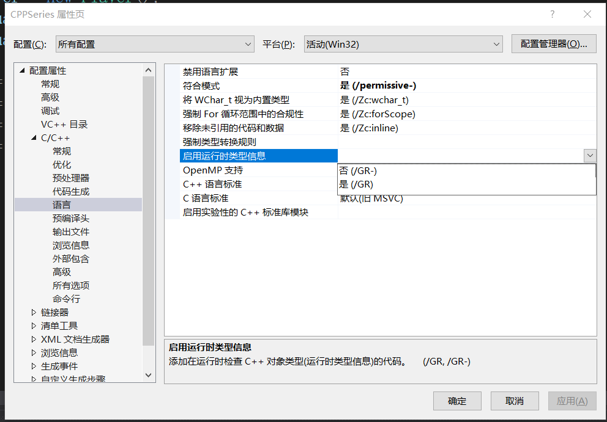
    - 在运行时进行计算
    - 可用于将基类转换为派生类，或将派生类转换为基类
    - 将实际属于Enemy类的对象使用dymanic_cast转换为Player类，则会失败，返回NULL指针
    - 可以用来检测对象是否属于某一类，如果不是则返回NULL；如果是则返回指向对象的指针
    - 运行时进行类型转换，被转换的类必须包含多态类类型，即有虚表(虚函数)
    ```
    class Entity
    {
    public:
        virtual void PrintName() {}
    };

    class Player : public Entity
    {
    };

    class Enemy : public Entity
    {
    };

    int main()
    {
        Player* player = new Player();
        Entity* actuallyPlayer = player;
        Entity* actuallyEnemy = new Enemy();

        //强转，但是如果此时Enemy类与Player类的函数不同，成员
        //变量不同，则会导致程序出错甚至崩溃
        Player* p0 = (Player*)actuallyEnemy;
        Player* p1 = static_cast<Player*>(actuallyEnemy);
        
        //需要让基类有虚表才能够使用dynmaic_cast，即创建虚函数
        //运行时转换类型，检测到类别不同，返回NULL
        Player* p2 = dynamic_cast<Player*>(actuallyEnemy);

        //类别相同，返回对应指针
        Player* p3 = dynamic_cast<Player*>(actuallyPlayer);
    }
    ```
  - const_cast:
    - 添加和移除const修饰符

## 预编译头文件(precompiled header，PCH)
- 一般用于大型项目中
- 抓取一堆头文件，并将其转换为编译器可直接使用的格式，而不必一次又一次读取这些文件
- 正常使用时，如果有多个cpp文件均包含了同一个头文件，则在编译时，编译器会将头文件中的内容全部复制到对应的cpp文件中并进行编译，这会导致每一个cpp文件都会编译一次该头文件；而当对某个cpp文件进行更改后再进行编译，又会重新编译一次头文件；以上均会增加编译时间
- 实际上就是一个头文件，会接受其他的头文件，并仅编译一次后，这些数据就会以二进制的形式供编译器直接使用；其他cpp文件包含部分头文件时，则可以跳过头文件的编译过程，节约时间
- 可以把标准库的头文件、自己写的头文件放进去；但是不要把经常需要改动的文件放入，频繁编译PCH会增加编译时间
- 应该放一些大部分cpp文件都会用到的头文件，例如std
- 缺点：由于每一个cpp都需要包含PCH，但是并不知道cpp文件实际调用的是PCH中的哪部分头文件；会影响可读性
- 建立方式：
  - Visual Studio：建立`pch.h`文件，将需要的头文件全部include到该该头文件中，并建立`pch.cpp`文件，只需包含`pch.h`头文件;
    右键项目属性，如下图设置(可以让该项目下其他cpp文件全部使用如下配置)
    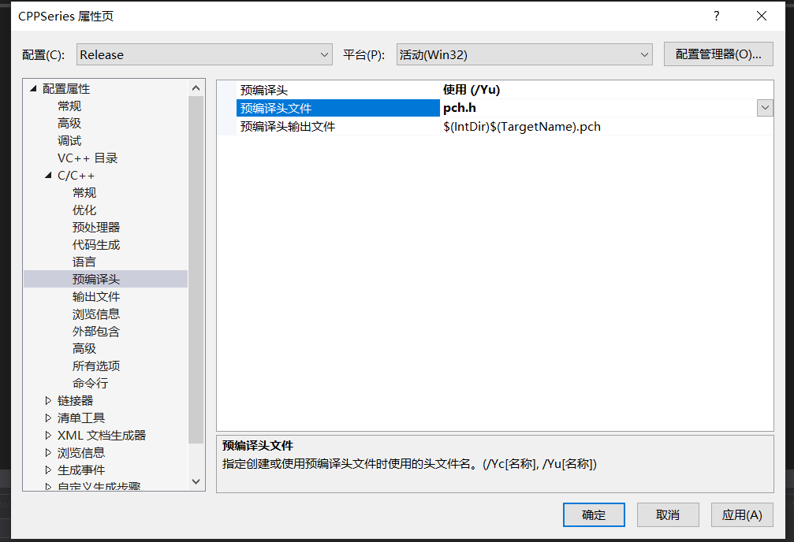
    右键`pch.cpp`属性，如下图设置(预编译头文件可以删除)
    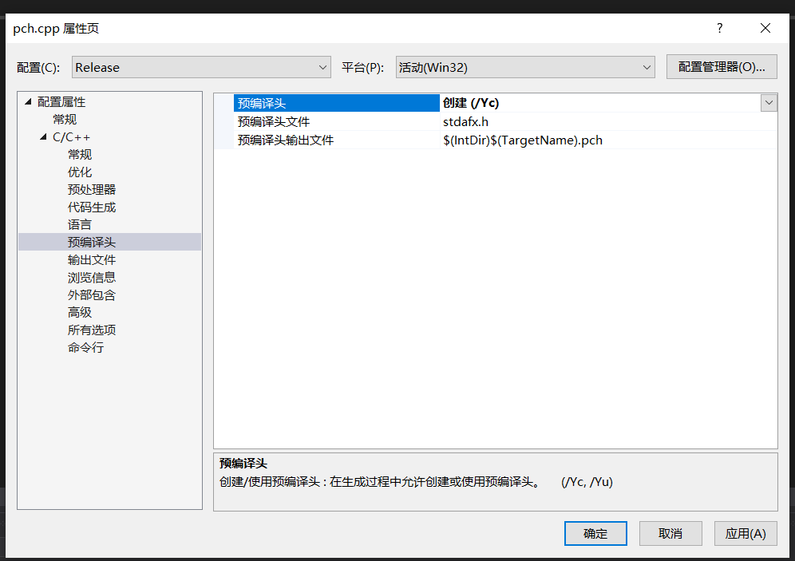
    测试编译时间：工具->选项->项目与解决方案->...如下设置
    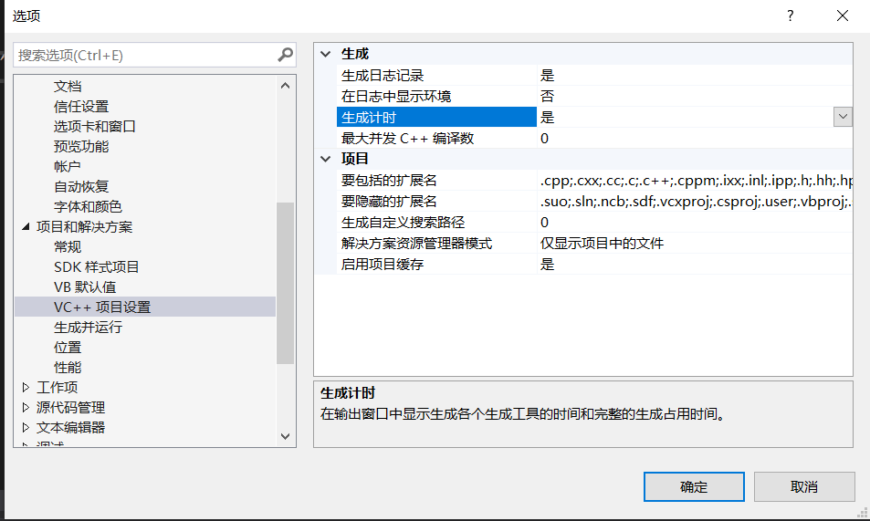
    使用预编译头初次编译：2175 毫秒

    使用预编译头二次编译：449 毫秒

    不使用预编译头初次编译：2984 毫秒

    不使用预编译头二次编译：1577 毫秒
  - g++：
    ```
    g++ -std=c++11 pch.h    //预编译头
    g++ -std=c++11 Main.cpp //执行main函数
    ```

## 基准测试(benchmark)
- 一定要在Release模式下进行测试，因为编译器不会添加额外的Debug代码，能够获得更准确的测试数据
- `make_shared<class_name>()` 往往比 `shared_ptr<class_name>(new class_name())`更快
- `make_unique<class_name>()`往往比`make_shared<class_name>()`更快

## C++17特性
- 后缀表达式必须在其他表达式之前计算，例如：`funciton(value++, value++); value = 1;`则其中前一个是1，后一个是0(当然这是未定义行为，具体实现由不同的编译器来决定，此处只是可能的一种结果)

**std::optional数据**
- 在程序中数据可能有时会存在，而有时又不存在；例如：读取文件，若该文件无法读取该采取何种措施
- **c++17**引入的新特性
    ```
    #include<optional>
    std::optional<std::string> ReadFileAsString(const std::string& filepath)
    {
        std::ifstream stream(filepath);
        if (stream)
        {
            std::string result;
            //read file
            stream.close();
            return result;
        }
        return {};	//{}是std::optional
    }

    int main()
    {
        auto data = ReadFileAsString("a.txt");
        if (data.has_value())	
        //此处也可以直接使用data,因为有一个bool运算符
        {
            //std::string& str = *data;	//直接访问字符串
            //std::string& str = data.value();	//同上
            std::string str = data.value_or("not that");
            //如果读取失败可以使用默认值"not that"
            //因为有常量字符，不能使用引用
            std::cout << "Read File Successfully" << std::endl;
        }
        else
        {
            std::cout << "File could not be opened " << std::endl;
        }
    }
    ```
**单一变量存储多种类型的数据(std::variant)**
- 列出可能的数据类型，例如:`std::variant<std::string, int>`数据就有可能是string或int
- 与union类似，但是并不是同一块内存空间的解释类型不同。此外，union的内存空间是按其中成员类型的最大占用空间计算得来。而variant则是对每一个可能的类型都开辟了一个空间，**variant占用的内存空间为其所有数据类型的空间总和**；更像是建立了一个struct包含需要的成员类型
- 相较于union更加安全，存储时的数据类型必须与读取时的数据类型一致，且数据类型不能够超出包含的范围
    ```
    #include<variant>
    enum class FileNum
    {
        NONE = 0, NOT_FOUND = 1, NO_ACCESS = 2
    };


    std::variant<std::string, FileNum> ReadFileAsString(const std::string& filepath)
    {
        //如果读取文件失败可以返回相应的整数，相较于bool能够读取更多信息
        return {};
    }

    int main()
    {
        std::variant<std::string, int> data;
        std::cout << sizeof(int) << std::endl;  //输出4
        std::cout << sizeof(std::string) << std::endl;  //输出28
        std::cout << sizeof(data) << std::endl; //输出32

        data = "Name";
        std::cout << std::get<std::string>(data) <<std::endl;
        //std::cout << std::get<int>(data) << std::endl;	//报错，类型不对

        data = 2;
        std::cout << std::get<int>(data) << std::endl;

        std::cout << data.index() << std::endl;	//返回类型索引，输出1为int

        /*data = false;		//类型不在内，则无法访问
        std::cout << std::get<bool>(data) << std::endl;*/

        auto value = std::get_if<std::string>(&data);	//返回指针，若为空则类型不对
        //可以利用这个方法检测类型
        if (auto value = std::get_if<int>(&data))
        {
            int str = *value;
            std::cout << str << std::endl;
        }
    }
    ```
**单一变量存储任意类型的数据(std::any)**
- 可以使用void，但是非常不安全
- 一般不用这个东西，
- 当类型的大小较小时，不会再次申请内存空间(p78视频里说是32B?)，当超过一定大小(32B?)会重新申请空间，较为费时
- 对于存储小类型数据来说，工作方式与variant完全相同，如果是大类型，则会变成void*，然后动态申请空间
    ```
    #include<any>
    int main()
    {
        std::any data = std::make_any<std::string>("Name");	//只能放一个值
        data = "Name";	//const char*
        std::string std = std::any_cast<const char*>(data);	//映射时必须类型一样
    }
    ```

**简化键值对的访问方式**
```
std::unordered_map<std::string, int> map;
//c++17以前访问
for(auto kv : map)
{
    auto& key = kv.first;
    auto& value = kv.second;
    std::cout << key << " = " << value << std::endl;
}

//c++17及以后访问
for(auto [key, value] : map)
{
    std::cout << key << " = " << value << std::endl;
}
```

## 提高性能
**多线程提高性能**
- 实现并行需要找出代码之间的依赖关系，并清楚在不同的线程中存放合适的代码
- 将串行的for循环变为并行的for循环，如果这些循环都是独立的话，即上一循环加载的内容并不会影响后续循环的加载；例如：加载同一个物品多次，或者加载互不相干的多个物体
- C#中有现成的并行for循环库。但是C++没有(过分昂)
    ```
    #include<future>

    //互斥锁
    static std::mutex s_MeshesMutex;

    void Load(const std::string& filepaht)
    {
        //load mesh
    }

    //Ref是用来保证vector中存储的都是Mesh类型的引用，节省空间
    //复制filepath是因为在并行for循环中，传入的file在超出该作用域
    //后便会消失，为了防止访问已被删除的内存而采用复制
    static void LoadMesh(std::vector<Ref<Mesh>>* meshes, std::string filepath)
    {
        auto mesh = Load(file);

        //锁定，防止其他线程修改meshes；
        //此外， 该锁也会在离开作用域后自动解锁
        //Lock_guard的析构函数会自动解锁
        std::Lock_guard<std::mutex> lock(s_MeshesMutex);
        meshes->push_back(mesh);
    }

    int main()
    {
        //void为异步调用的函数的返回值
        std::vector<std::future<void>> m_Futures;

        std::vector<std::string> filepaths;
        //load filepaths
        std::vector<std::string> m_Meshes;
    //预处理，ASYNC为1则进行并行for循环
    #define ASYNC 1
    #if !ASYNC
        //串行for循环，上一个加载完后，才会开始下一个加载
        for(const auto& file : filepaths)
        {
            m_Meshes.push_back(Load(file));
        }
    #else
        //并行for循环
        for(const auto& file :filepaths)
        {
            //第一个参数是什么类型的job，
            //如果不设置为launch::async，
            //则可能不会在单独调用一个线程上工作，
            //c++会根据当前工作负载来选择
            //(可以在适当的地方使用，例如：加载压力较大的场景等)
            //第二个参数是实际需要异步运行的函数
            //后面的参数都是异步运行的函数的参数

            //该函数会返回std::future，必须进行保留，如果不保留
            //就会被摧毁，因此，保存返回值这一步只能串行for循环
            //在每一次迭代中，以下函数都会在future的析构函数中，
            //只要LoadMesh一结束就会直接析构
            m_Futures.push_back(std::async(std::launch::async, LoadMesh, &m_Meshed, file));

        }

    }
    ```
**string优化**
- 直接使用std::string来接收字面值常量会出现内存分配，此外，使用substr()等函数同样会导致内存分配情况的出现
- 通过使用**c++17**引入的新特性`string_view`实现对原先字符串的访问，而非复制减少内存空间的分配
    ```
    static int s_AllocCount = 0;    //记录申请空间次数

    void* operator new(size_t size)
    {
        s_AllocCount++;

        //记录每次申请空间大小
        std::cout << "Allocated " << size << " Bytes\n";
        return malloc(size);
    }

    void PrintName(const std::string& str)
    {
        std::cout << str << std::endl;
    }

    void PrintName(std::string_view str)    //重载
    {
        std::cout << str << std::endl;
    }

    int main()
    {
        //共申请三次空间，每次8B
        //std::string str = "Name Last";
        //std::string firstname = str.substr(0, 4);
        //std::string lastname = str.substr(4, 4);

        //不申请空间；
        //如果str是std::string类型，则后两句代码需要传入str.c_str()，作为指针传入
        const char* str = "Name Last";
        std::string_view firstname = std::string_view(str, 4);
        std::string_view lastname = std::string_view(str + 4, 4);

        PrintName(firstname);

        std::cout << "allocated " << s_AllocCount << " epoch\n";
    }
    ```
- c++标准库对于短字符串的实现并不是直接为其分配空间(堆分配)。当字符串的字符数小于等于15(**VS2019中**)时，会将该字符串分配到一个临时的静态栈缓冲区中(在debug模式下，仍然会分配，但是在release
模式下则不会分配)

## 跟踪内存
- 通过重载new 和 delete 操作符，实现对内存分配数量的跟踪
- 使用单例模式进行设计
    ```
    class AllocationMetrics
    {
    public:
        AllocationMetrics() {}

        AllocationMetrics(const AllocationMetrics&) = delete;

        static AllocationMetrics& Get()
        {
            static AllocationMetrics s_allocationMetrics;
            return s_allocationMetrics;
        }

        static uint32_t CurrentUsage()
        {
            return Get().ICurrentUsage();
        }

        static void AllocationPlus(size_t size)
        {
            Get().TotalAllocated += size;
        }

        static void AllocationMinus(size_t size)
        {
            Get().TotalFreed += size;
        }

    private:
        uint32_t TotalAllocated = 0;
        uint32_t TotalFreed = 0;
        uint32_t ICurrentUsage()
        {
            return TotalAllocated - TotalFreed;
        }

    };

    void* operator new(size_t size)
    {
        AllocationMetrics::Get().AllocationPlus(size);
        return malloc(size);
    }

    void operator delete(void* memory, size_t size)
    {
        AllocationMetrics::Get().AllocationMinus(size);
        free(memory);
    }

    static void printUsage()
    {
        std::cout << "Memory " << AllocationMetrics::CurrentUsage() << " bytes\n";
    }

    struct object
    {
        int x, y, z;
    };

    int main()
    {
        printUsage();
        std::string str = "Name";
        printUsage();
        {
            object* o = new object();
            printUsage();

            std::unique_ptr<object> a = std::make_unique<object>();
            printUsage();
        }
    }

    //使用struct实现单例模式
    struct AllocationMetrics
    {
        uint32_t TotalAllocated = 0;
        uint32_t TotalFreed = 0;
        uint32_t CurrentUsage()
        {
            return TotalAllocated - TotalFreed;
        }
    };

    AllocationMetrics s_AllocationMetrics;

    void* operator new(size_t size)
    {
        s_AllocationMetrics.TotalAllocated += size;
        return malloc(size);
    }

    void operator delete(void* memory, size_t size)
    {
        s_AllocationMetrics.TotalFreed += size;
        free(memory);
    }

    void PrintMemoryUsage()
    {
        std::cout << "Memory " << s_AllocationMetrics.CurrentUsage() << " bytes\n";
    }

    struct object
    {
        int x, y, z;
    };

    int main()
    {
        PrintMemoryUsage();
        std::string str = "Name";
        PrintMemoryUsage();
        {
            std::unique_ptr<object> o = std::make_unique<object>();
            PrintMemoryUsage();
        }
    }
    ```

## 左值(lvalue)右值(rvalue)与移动语义
- 左值绝大多数时候处于等式的左侧，而右值则处于右侧，例如`int i = 10`，其中i是左值，10是右值；右值无法给左值赋值，而左值可以给左值赋值(右值仅仅是字面值，并没有存储空间)，例如`10 = i; //错误，无法赋值；int a = i; //正确`；
- 函数的返回值是右值
- 左值引用：函数返回的是一个引用，则该返回的值或对象必须拥有自己的存储空间，此时可以将其作为左值进行赋值操作；只有左值才能够被引用；
- 涉及const的左值引用：`int& a = 10;`，报错，因为10是右值，并不能使用左值来引用右值，因为此时引用创建的只是一个类似于指针的东西，当10这个右值消失后，a就无法被正确解析，程序会崩溃；但是，在该代码前加入const，即`const int& a = 10;`则可以正确运行。编译器实际上是继续了以下操作`int temp = 10; const int& a = temp;`；此原理同样适用于函数
    ```
    /若未使用const，则无法将右值作为参数输入到函数中
    void SetValue(const int& value);
    SetValue(i);
    SetValue(10);
    ```
    **常量引用(const classname&)** 可以兼容临时的右值引用以及实际存在的左值变量，这也是为什么大多数函数都使用了常量引用
- 右值引用：函数只接受临时对象，使用`&&`来进行右值引用；当进行重载时，如果有右值引用的函数并且有存在常量引用的函数时，在使用临时对象时，编译器仍然会选择右值引用的函数进行操作
- **移动语义**
  - 其实类似于将原先的深拷贝变为了浅拷贝，且做了一系列措施防止在删除临时对象时删除对应数据，导致程序报错；例如：`function("abcd");`，会先将`"abcd"`变成string类，然后在进行深拷贝(即进行第二次堆分配存储对应数据)，而通过移动语义可以减少这次拷贝(类似于使用指针进行传输) <strong><font color='red'>当然，此处举的例子不是特别恰当</font></strong>
  - `std::move`是将一个对象转换成临时对象，从该对象中窃取数据赋值给其他对象，可以大大提高性能；大多数时候是与移动构造函数和移动赋值操作符相结合使用以防止错误调用拷贝构造函数和拷贝赋值操作符
    ```
    class String
    {
    public:
        String() {}
        String(const char* string)
        {
            std::cout << "Created!\n";
            m_Size = strlen(string);
            m_Data = new char[m_Size + 1];
            memcpy(m_Data, string, m_Size);
            m_Data[m_Size] = 0;
        }

        String(const String& other) //拷贝构造函数
        {
            std::cout << "Copied!\n";
            m_Size = other.m_Size;
            m_Data = new char[m_Size + 1];
            memcpy(m_Data, other.m_Data, m_Size);
            m_Data[m_Size] = 0;
        }


        String(String&& other) noexcept //移动构造函数
        {
            std::cout << "Moved!\n";
            m_Size = other.m_Size;
            m_Data = other.m_Data;
            other.m_Data = nullptr;
            other.m_Size = 0;
        }

        String& operator=(String&& other) noexcept  //赋值操作符
        {
            std::cout << "Moved!\n";

            if (this != &other)
            {
                delete[] m_Data;	//防止内存泄漏
                m_Size = other.m_Size;
                m_Data = other.m_Data;
                other.m_Data = nullptr;
                other.m_Size = 0;
            }

            return *this;
        }
        ~String()
        {
            std::cout << "Destroyed!\n";
            delete[] m_Data;
        }

        void Print()
        {
            if (m_Data) //与视频不一致，不判断是否为空会报错
            {
                for (uint32_t i = 0; i <= m_Size; ++i)
                {
                    std::cout << m_Data[i];
                }
            }
            std::cout << "\n";
        }
            
    private:
        char* m_Data;
        uint32_t m_Size;

    };

    class Entity
    {
    public:
        Entity(const String& name) 
            :m_Name((String&&)name)
        {
        }

        void PrintName()
        {
            m_Name.Print();
        }

    private:
        String m_Name;
    };

    int main()
    {
        Entity entity("abc");
        entity.PrintName();

        String apple = "Apple";
        String dest;
        //String dest = std::move(apple);   //移动构造函数
        apple.Print();
        dest.Print();
        dest = std::move(apple);    //赋值操作符
        apple.Print();
        dest.Print();

        std::cin.get();
    }
    ```

## C++三法则、五法则
- 三法则：如果需要析构函数，就必须要有拷贝构造函数和拷贝赋值操作符；
- 五法则：在三法则的基础上，还要增加移动构造函数和移动赋值操作符

## 部分数据结构实现
- **Array**
  - 使用模板函数来实现可变数组大小(编译时)；重载索引操作符并且注意还需要重载const的索引操作符，防止创建的const对象无法进行访问；
    ```
    template<typename T, size_t S>
    class Array
    {
    public:
        constexpr size_t Size() const
        {
            return S;
        }

        T& operator[](size_t index)	
        //使用size_t，避免因为平台不同导致int位数不同
        {
            if (!((index >= 0) && (index < S)))	
            //检测索引是否在正确区域 否则报错
            {	
                //是双下划线__，如果出错则会在此处停止
                __debugbreak();						//且在release模式下要去除，否则会带来额外的性能开销
            }
            return m_Data[index];
        }

        const T& operator[](size_t index) const
        {
            if (!((index >= 0) && (index < S)))
            {
                __debugbreak();		
            }
            return m_Data[index];
        }

        T* Data()		
        //实际访问其中的数据，便于使用memset等方法
        {
            return m_Data;
        }

        const T* Data() const
        {
            return m_Data;
        }

    private:
        T m_Data[S];
    };

    int main()
    {
        Array<int, 5> array;

        memset(array.Data(), 0, array.Size() * sizeof(int));

        //memset(&array[0], 0, array.Size() * sizeof(int));	
        //也能够成立，因为栈分配必然是连续的

        for (size_t i = 0; i < array.Size(); ++i)
        {
            //array[i] = 2;
            std::cout << array[i] << std::endl;
        }

        const auto& arrayReference = array;
        for (size_t i = 0; i < arrayReference.Size(); ++i)
        {
            //arrayReference[i] = 2;    //const对象无法更改值
            std::cout << arrayReference[i] << std::endl;
        }
    }
    ```
- **vector**
    - 当遇到需要调用构造函数和析构函数的类时，例如`std::string`，会报无法访问内存的错误，这是由于string等其他类型创建时需要调用构造函数，但是在vector中，进行申请空间和添加元素并没有调用构造函数，即`T* newblock = (T*)::operator new(newCapacity * sizeof(T));`上述代码只会申请符合内存要求的空间，并不会调用构造函数去构造newCapacity个T对象。因此，当插入元素或者初始化vector时，都只有空间而没有数据结构。所以需要使用一种方法来使得在指定的内存空间上调用构造函数。
    - 在`vector::EmplaceBack(Args&&... args)`中，需要使用`new (&m_Data[m_Size]) T(std::forward<Args>(args)...);`以及在`vector::ReAlloc(size_t newCapacity)`中，进行语义移动时，需要使用`new (&newblock[i]) T(std::move(m_Data[i]));`，以此在指定内存地址调用构造函数
    ```
    //vector.h
    template<typename T>
    class vector
    {
    public:
        vector()
        {
            ReAlloc(2);
        }

        ~vector()
        {
            //直接使用delete实际上是调用T的析构函数
            //当T拥有堆分配的数据，可能会调用两次析构导致报错
            //在该类中，使用PopBack后，第一次调用析构会将堆分配数据删除
            //但是并没有将该指针从m_Data中删除，我们只是通过m_Size来模拟删除操作
            //当进行以下操作时，仍会再次调用析构函数导致删除两次堆分配数据从而报错
            //delete[] m_Data;

            Clear();
            ::operator delete(m_Data, m_Capacity * sizeof(T));
            //会删除内存空间，而不会通过调用析构函数来删除数据
        }

        void PushBack(const T& value)
        {
            if (m_Size >= m_Capacity)
            {
                ReAlloc(m_Capacity * 2);
            }
            m_Data[m_Size++] = value;
        }

        //即使参数声明了是右值引用，在函数中仍然会以左值来看，所以后面仍然需要std::move
        void PushBack(T&& value)
        {
            if (m_Size >= m_Capacity)
            {
                ReAlloc(m_Capacity * 2);
            }
            m_Data[m_Size++] = std::move(value);
        }

        template<typename... Args>	//可变数量参数
        //返回其引用，因为是就地构建，为了更加容易取回对象
        T& EmplaceBack(Args&&... args)	//接受所有参数
        {
            if (m_Size >= m_Capacity)
            {
                ReAlloc(m_Capacity * 2);
            }
            m_Data[m_Size] = T(std::forward<Args>(args)...);	
            //...是为了解包这些参数，将其转发给T，使用对应的构造函数进行构造
            //例如啥都没传入，则相当于Vector3();
            //又例如传入2,3,4，则相当于Vector3(2,3,4);
            //如果传入的参数与构造函数不符，则会编译报错

            //还有种奇巧淫技，甚至能够不使用move
            //通过直接new出对象，并使用该对象覆盖掉对应位置即可
            //即，创建了一个位置就在m_Data[m_Size]上的对象T(std::forward<Args>(args)...)
            //new(&m_Data[m_Size]) T(std::forward<Args>(args)...);
            return m_Data[m_Size++];
        }

        void PopBack()
        {
            if (m_Size > 0)
            {
                m_Size--;
                m_Data[m_Size].~T();	//调用栈顶元素的析构函数
            }
        }

        void Clear()
        {
            for (auto i = 0; i < m_Size; ++i)
            {
                m_Data[i].~T();
            }

            m_Size = 0;
        }

        T& operator[](size_t index)
        {
            if (!((index >= 0) && (index < m_Size)))
            {
                __debugbreak();
            }
            return m_Data[index];
        }

        const T& operator[](size_t index) const
        {
            if (!((index >= 0) && (index < m_Size)))
            {
                __debugbreak();
            }
            return m_Data[index];
        }

        size_t Size() const
        {
            return m_Size;
        }

        size_t Capacity() const
        {
            return m_Capacity;
        }


    private:
        void ReAlloc(size_t newCapacity)
        {
            //1.分配新空间
            //2.copy/move
            //3.删除旧空间
            //T* newblock = new T[newCapacity];
            //以下是不调用构造函数版本的new
            //只需要申请足够的空间即可
            //返回void 需要进行类型转换
            T* newblock = (T*)::operator new(newCapacity * sizeof(T));

            if (m_Size > newCapacity)
            {
                m_Size = newCapacity;	//这不是会导致部分数据丢失嘛
            }

            for (size_t i = 0; i < m_Size; ++i)
            {
                //使用move而非copy
                newblock[i] = std::move(m_Data[i]);
            }

            //memset(newblock, m_Data, m_Size);	//当是自定义类型时，会出错

            //delete[] m_Data;
            for (auto i = 0; i < m_Size; ++i)
            {
                m_Data[i].~T();
            }
            ::operator delete(m_Data, m_Capacity * sizeof(T));

            m_Data = newblock;
            m_Capacity = newCapacity;
        }

    private:
        T* m_Data = nullptr;
        size_t m_Size = 0;
        size_t m_Capacity = 0;
    };

    //**********************************************
    //main.cpp

    struct Vector3
    {
        float m_x = 0.0f, m_y = 0.0f, m_z = 0.0f;

        Vector3() {}

        Vector3(float scale)
            : m_x(scale), m_y(scale), m_z(scale) {}

        Vector3(float x, float y, float z)
            : m_x(x), m_y(y), m_z(z) {}

        Vector3(const Vector3& other)
            : m_x(other.m_x), m_y(other.m_y), m_z(other.m_z)
        {
            std::cout << "Copy!\n";
        }

        Vector3(Vector3&& other)
            : m_x(other.m_x), m_y(other.m_y), m_z(other.m_z)
        {
            std::cout << "Move!\n";
        }

        ~Vector3()
        {
            std::cout << "Destroy!\n";
        }

        Vector3& operator=(const Vector3& other)
        {
            std::cout << "Copy!\n";
            m_x = other.m_x;
            m_y = other.m_y;
            m_z = other.m_z;
            return *this;
        }

        Vector3& operator=(Vector3&& other)
        {
            std::cout << "Move!\n";
            m_x = other.m_x;
            m_y = other.m_y;
            m_z = other.m_z;
            return *this;
        }
    };

    template<typename T>
    void PrintVector(const vector<T>& vec)
    {
        for (auto i = 0; i < vec.Size(); ++i)
        {
            std::cout << vec[i] << std::endl;
        }

        std::cout << "----------------------\n";
    }

    void PrintVector(const vector<Vector3>& vec)
    {
        for (auto i = 0; i < vec.Size(); ++i)
        {
            std::cout << vec[i].m_x << " " << vec[i].m_y << " " << vec[i].m_z << std::endl;
        }

        std::cout << "----------------------\n";
    }

    int main()
    {
        vector<Vector3> vec;
        /*vec.PushBack(Vector3());
        vec.PushBack(Vector3(1.0f));
        vec.PushBack(Vector3(2, 3, 4));
        PrintVector(vec);*/

        //EmplaceBack并不会先生成一个临时对象
        //而是只接受数据，然后在自己的数据块中直接进行构建
        //从而减少复制带来的性能损失
        vec.EmplaceBack();	//相当于PushBack(Vector3());
        vec.EmplaceBack(1.0f);	//相当于PushBack(Vector3(1.0f));
        vec.EmplaceBack(2, 3, 4); //相当于PushBack(Vector3(2, 3, 4));
        PrintVector(vec);
    }
    ```

- **iterator**
    - 其实质就是指针
    ```
    template<typename vector>
    class VectorIterator
    {
    public:
        using ValueType = typename vector::ValueType;
        using PointerType = ValueType*;
        using ReferenceType = ValueType&;

    public:
        VectorIterator(PointerType _Ptr)
            : m_Ptr(_Ptr) {}

        VectorIterator& operator++()	//前置递增运算符 ++i 可以避免创建临时对象
        {
            m_Ptr++;
            return *this;
        }

        VectorIterator operator++(int)	//后置递增运算符 i++
        {
            VectorIterator iterator = *this;
            ++(*this);	//访问上面的前置递增运算符
            return iterator;
        }

        VectorIterator& operator--()	//前置递减运算符
        {
            m_Ptr--;
            return *this;
        }

        VectorIterator operator--(int)	//后置递减运算符
        {
            VectorIterator iterator = *this;
            --(*this);	
            return iterator;
        }

        ReferenceType operator[](int index)
        {
            return *(m_Ptr + index);
        }

        PointerType operator->()	//箭头运算符 ptr->member
        {
            return m_Ptr;
        }

        ReferenceType operator*()	//解引用
        {
            return *m_Ptr;
        }

        bool operator==(const VectorIterator& other) const
        {
            return m_Ptr == other.m_Ptr;
        }

        bool operator!=(const VectorIterator& other) const
        {
            //return m_Ptr != other.m_Ptr;	//也可以实现，只是为了代码统一使用下面的代码
            return !(*this == other);
        }
    private:
        PointerType m_Ptr;
    };

    //需要在vector类中添加部分代码，以此实现与vectorIterator类的联动
    class vector
    {
    public:
        using ValueType = T;
        using Iterator = VectorIterator<vector<T>>;

    public:
        Iterator begin()
        {
            //return VectorIterator<vector<T>>(m_Data); //可以使用该代码，使用上述重定义的类名可以简写
            return Iterator(m_Data);
        }

        Iterator end()
        {
            //return VectorIterator<vector<T>>(m_Data + m_Size); //同上
            return Iterator(m_Data + m_Size);
        }
    }

    //main.cpp
    int main()
    {
        //int 
        //可以直接运行
        vector<int> values;
        values.EmplaceBack(1);
        values.EmplaceBack(2);
        values.EmplaceBack(3);
        for (auto& value : values)
        {
            std::cout << value << " ";
        }
        std::cout << std::endl;

        //std::string
        vector<std::string> values;
        values.EmplaceBack("1");
        values.EmplaceBack("2");
        values.EmplaceBack("3");
        for (auto& value : values)
        {
            std::cout << value << " ";
        }
        std::cout << std::endl;
    }
    ```

## 位运算符
- 可以调用bitset来进行bit值的输出，`std::cout << std::bitset<num>(a) << std::endl;`，num为需要显示的位数
- `<<`：左移运算符，相当于乘2，当需要赋值时，一定要使用`<</>>=`才能够将值覆盖掉，否则会无效；例如:`int a = 0b0101`，当采用`a << 4`时，只是把a左移了四位，但是a的值仍然是0b0101;而采用`a <<= 4`时，则是把a左移四位同时赋值给a，a的值则为0b01010000
- `>>`：右移运算符，相当于除2，基本都是向下取整，因为这两个运算符大多作用于unsigned int
- `&`：按位与，可以作为if条件来使用；例如：有一个数值，其中的每一位都代表一个选择，如果我们需要某种选择，则可以创建这样的一个数值，进行按位与操作，如果结果不为0则代表数值可用，否则不可用
    ```
    a = 1010 1100; //共8种选择，a选择了其中的四种，用1表示
    b = 0000 1000; //创建数值，如果对象选择了第五种则采用
    if(a & b) {}   //a & b = 0000 1000 != 0 所以执行if语句
    ```
- `|`：按位或，可以对数值进行还原，例如：原来`a = 0b1010 0100;` 但是之后通过某些代码，a变成了0b0100，此时如果需要将其复原则需要额外创建一个数值`b = 0b1010; b <<= 4;`再将两者相或则可恢复，即`c = a | b;`，c = 0b1010 0100
- `~`：按位取反，可以与`&`结合实现一些需求
- `^`：按位异或，对应位相同为0，不同为1；与自身进行按位异或，必然得到0；

## std::map and std::unordered_map
- std::map使用红黑树实现，会自动对键值进行排序
- std::unordered_map使用哈希函数进行映射
- 虽然可以使用自定义的数据结构作为键值输入，但是对于std::map需要重载运算符<，因为涉及到红黑树的排序问题；而对于std::unordered_map需要根据实际要求实现其hash函数，例如：
    ```
    namespace std {
        template<>
        struct hash<自定义数据结构>
        {
            size_t operator()(const 自定义数据结构& key)
            {
                //根据需求设定合适的函数并将其结果返回
                //例如，将自定义数据结构中的string进行hash运算，使用现成的string的hash函数
                //return hash<std::string>()(key.name)
                return answer;
            }
        }
    }
    ```
- 但是可以使用自定义数据结构的指针作为键值输入，因为指针就是64位无符号数，可以直接调用std中针对该类型的hash函数