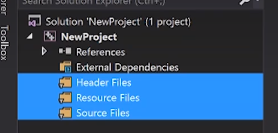

## 一些tips
- 编译单元(translation unit)：一个单独的文件，例如cpp
- 使用sizeof(数据类型)可以得到对应数据类型的大小(以字节为单位)
- `#pragma once`：被称为 **头文件保护符（"header guard"）**，防止我们将单一头文件多次include到单一编译单元中；或者多个文件会include一个头文件，然后最后的main文件又会将这些文件全部include导致出现多次include；
  - 有另外一种头文件保护符，如下所示:
    - 首先判断_LOG_H是否已经被包含在里面，若没有则复制下面的代码；否则直接跳过；
    - 然后，将该文件定义为LOG_H

- #include的文件如果有.h后缀则属于c标准库，若没有则属于c++
- `else if`其实并不是关键字，而是以下的缩写（但还是会有点问题，比如再往后写else就没有对应的if，这个可以在该else中嵌套else 也许能解决）
```
else
{
    if() {}
}
```
- 下列三个均为筛选器，而不是真正的文件夹，是以虚拟文件夹的形式来组织代码


- 由于VS本身会将编译时生成的文件放到项目文件夹下的Debug文件夹中；而最终生成的exe文件则会放到与.sln同级的Debug文件夹中，查看比较麻烦，可以在下面的设置中更改路径存到指定的文件夹中，并可以区别不同平台以及Debug模式或Release模式


- c++11中使用char类定义字符串必须要定义成以下形式`const char* message`，不能省略`const`；双引号的类型是const char*，而单引号才是char；如果想创建char[]来存储字符串，必须要多申请一个空间用来存储空终止符0,例如:`char[5] = {'N', 'a', 'm', 'e', 0};`

- 字符串字面值(string literals)：实际是双引号之间的内容，例如
`"name"`；只存在于只读内存中

- 几种不同的char
```
const char* name = u8"name";    //也可以省略u8,8bit
const wchar_t* name1 = L"name"; //宽字符,根据编译器不同
                                //可能是8bit、16bit、32bit
                                //windows上16bit
                                //linux上32bit
//c++11引入
const char16_t* name2 = u"name";    //16bit
const char32_t* name3 = U"name";    //32bit
```

- string进行字符串字面值相加时，只能有一个是字符串字面值
```
//std::string name = "name" + "hello";    //报错
//std::string name = std::string("name") + "hello";   //成功

//或者
using namespace std::string_literals;
std::string name = "name"s + "hello";

//或者
//R忽略转义符，即使加入\n，也会一起打印出来
const char* name = R"(Line1         //输出：Line1
Line2                                       Line2
Line3)"；                                   Line3

//想换行必须加入\n
const char* name1 = "Line1\n"       //输出：Line1
    "Line2\n"                               Line2
    "Line3"\n;                              Line3
```

## 预处理
- 包含`#include, #define, #if, #endif`，其本质都是将对应的文件内容复制到对应位置；
例如：有两个文件`EnBranch.h`和`Math.cpp`
- `#if`可以让我们根据特定条件包含或剔除代码
```
//EnBranch.h
}

//Math.cpp
#define INTEGER x

#if 0           //为0时，则这一部分代码不会进行编译，为1则正常编译
INTEGER multiply(int a, int b) //生成的预处理文件.i中就会把INTE替换成x
{
    INTEGER result = a * b;
    return result;
#include"EnBranch.h"    //此处就是把EnBranch.h的内容复制过来，即'}'
#endif
```
- 修改如下设置便可以生成.i文件(生成了.i文件后边不后悔生成.obj文件 **(.obj文件内容是01机器码)**；.i文件如下图二和三所示)


- 修改如下设置，获得.asm文件得到汇编代码，默认debug模式下会插入很多代码便于进行debug，但是会延长程序运行时间

- 在debug模式下设置为速度最优策略，会得到简洁的汇编代码，但是编译时会发生错误，需要进行相应设置(下图二)


## 链接(Linking)
- 每一个cpp文件在编译后都会生成.obj文件，然后将他们链接成.exe文件
- 每一个.exe文件必须要有一个入口函数，这个函数不一定非要是main函数，可以自定义，如下所示 **（入口点）**：

- **未解析的外部符号(unresolved external symbol):**
  
  `Log.cpp`中的Log函数被更换为Logr函数，导致Linker在进行链接时无法找到`Math.cpp`中`Multiply`函数调用的`Log`函数，从而导致链接失败
  - 如果在`Multiply`前面加上`static`，哪怕main函数中并没有调用该函数，仍然会报错；这是因为虽然在此处并没有被调用，在其他文件中也存在被调用的可能，所以Linker仍然会进行链接
  - 而加入`static`之后， 该函数只能够在`Math.cpp`文件中被调用，但是实际并没有被调用，所以不会报错


- **重复符号报错**：

    有相同的函数，相同返回值，相同参数列表；Linker就不知道该链接到哪个函数上，分为两种情况：
- 在同一个编译单元中存在完全相同的函数、返回值和参数列表，此时，编译器会直接帮我们检测出来

- 如果在不同编译单元有相同的函数、返回值和参数，此时，编译器无法查出错误，会被正确编译。但是当链接时，则会报错

- 或者，函数定义被写在`Log.h`中，然后存在多个文件同时调用该头文件。而`#inlcude`的逻辑就是把头文件中的代码全部复制到对应文件中，则会导致函数在两个文件中被同时定义，情况就如上面那个错误相同，导致链接失败
  - 一种解决方法是，在头文件中对应函数定义加上修饰词`static`，此时在不同文件中创建的该函数仅自己文件可见，例如`Math.cpp`和`Log.cpp`同时`#include"Log.h"`，则会同时生成两个Log函数，但是这两个Log函数对对方cpp文件是不可见的。在`Math.cpp`中的Log函数，`Log.cpp`是不可见的，就不会导致重复定义。
  - 另一种是增加修饰词`inline`，当cpp文件包含该头文件时，只会将函数本体拿过去替换，而不是定义一个函数
```
//Log.h
void Log(const char* message)
{
    std::cout << message << std::endl;
}

//Math.cpp
#include "Log.h"
int Multlpy (int a, int b)
{
    //Log("Multlpy")
    std:: cout << "Multlpy" << std::endl;
    return a* b;
}
```
- 第三种解决方法，在头文件中仅放函数声明，在cpp文件中写函数定义
```
//Log.h
void Log(const char* message);

//Log.cpp
#include"Log.h"
void Log(const char* message)
{
    std::cout<< message << std::endl;
}

//Math.cpp
#include"Log.h"
int Multlpy(int a, int b)
{
    Log("Multlpy);
    return a * b;
}
```

## 指针(pointer)
- **原始指针(raw pointer):**
  - 指针其实就是一个无符号整数，代表一个内存地址，前面的类型只是表明该内存地址中存储的数据的类型，与指针本身类型无关。
  - **`void* ptr = 0`**：0是地址，但是它不能够写入和读取，只是为了声明该指针为空，void代表完全没有类型，只是为了在进行写入和读取时告诉编译器需要申请多大的空间
  - `&变量`：取该变量的内存地址
```
int value = 8;
void* ptr = &value;
*ptr = 10;  //会报错，因为编译器不知道要申请多少空间来存储10
            //这个数字;只需要将上面的代码改为int* ptr = &value
            //即可正常写入

char* buffer = new char[8]; //向堆申请了8个字节空间，
                            //并将该空间的起始位置对应
                            //的地址赋给buffer
memset(buffer, 0, 8);   //用0去填充申请的空间
delete[] buffer;        //由于是从堆上申请的，需要手动释放
                        //因为申请的是数组，需要对应的delete[]
```

## 引用(reference)
- 与指针不同，引用必须引用一个已经存在的变量，本身不是变量不会占用内存空间，相当与给被引用对象创建了别名

##类(class)与结构体(struct)的区别
- c++保留struct是为了对c有一定的兼容性
- 类默认私有，结构体默认公有
- 具体什么情况使用什么，根据个人观点而定。一般来说，struct用来存储一些简单的变量以及简单的方法，而class则实现一些较为复杂的东西以，继承用class更好

## Static
- 在类或结构体的外面，则代表该类或结构体在link阶段是局部的，只对定义它的编译单元可见
```
//Static.cpp
static int value = 5;

//Main.cpp
int value = 10; //编译通过，
                //因为上面的value仅Static.obj文件可见
                //若上面没有static修饰词，则编译失败，
                //会提示link失败，因为该变量被定义了两次

extern int value;   //上面没有static修饰词，该句代码会让编译器从其他编译单元里找到value的定义(external linking)，如果上面有static修饰词，则unresolved external symbol 链接失败

```
- 在类或结构体内部，代表这部分内容是所有实例所共享的
  - 静态方法和静态变量没有对应的实例，所以静态方法无法调用非静态变量
- **静态局部变量：**
  - 假设函数中存在一个静态局部变量，在第一次调用该函数时会初始化为0，然后在每次调用该函数后进行自增操作，则会一直增加；若不是static，则每次会进行初始化并自增
```
void function()
{
    static int value = 0;   //此时主函数会打印1,2,3,4,5
                            //若没static，则会打印5次1
                            //相较于直接将其设置为全局变量
                            //这么设置的value只有才function
                            //中才会进行操作
                            //其他函数无法访问value；
    value++;
    std::cout << value << std::endl;
}

int main()
{
    for(int i = 0; i < 5; ++i)
    {
        function();
    }
}
```

## 单例模式

仅创建一个实例，并其生命周期为整个程序

```
class Singleton
{
private:
    static Singleton* s_Instance;
public:
    static Singleton& Get()
    {
        return *s_Instance;
    }

    void Hello();
};

Singleton* Siongleton::s_Instance = nullptr;

int main()
{
    Singleton::Get().Hello();
}

//简化版
class Singleton
{
public:
    static Singleton& Get()
    {
        static Singleton instance;  //将其生命周期延长至程序结束
                                    //第一次调用会创建实例；之后不会
        return instance;            //返回存在的唯一的一个实例
    }

    void Hello();
};

int main()
{
    Singleton::Get().Hello();
}
```

## 枚举(enums)
- 一些值的集合，给一个值指定一个名称
- 实际就是整数的集合，默认是递增；例如定义A、B、C，则分别为0、1、2；
若定义A=2、B、C，则分别为2、3、4
```
enum Example : unsigned char    //默认是int，但是可以设定类型(仅限整形，float、double不行)
{
    A, B, C //其中A=0;B=1;C=2(默认状况下，都是进行递增)
            //也可以自己赋值：A=2
};

Example value = A;  //value只能是Example中的一个
//Example value = 5； //会报错
```

## 类(class)
- **构造函数(constructor)**:
  - 会有默认构造函数
  - 可以进行函数重载
  - 当不需要默认构造函数时，可以`class_name() = delete`
  - 直接调用类内静态函数或变量时，构造函数并不会被调用
- 析构函数(destructor)：
  - 对象生命周期结束后(销毁后)自动调用
  - 可以用来释放申请的内存空间
- **继承(inheritance)**
  - 会继承父类的所有东西包括变量和函数
  - `class sub_class_name : public bas_class_name {};`
- **虚函数(virtual function)**
  - 问题来源：在类中正常声明函数，当调用这个函数时，总会去调用属于这个类型的函数
  - 虚函数引入了要动态分配的东西，因此引入了虚表(vtable)的概念用来编译，其中包含了类中所有虚函数映射列表 **(即想重写一个函数，必须把基类中的原函数设为虚函数，同时在子类的重写的那个函数后面加上override(c++11标准允许加入override标记)提高代码可读性)**
  - 会有内存开销，需要用来存储虚表，基类中有一个指针专门指向虚表；吗，每次调用虚函数都需要去遍历虚表，带来性能损失(但是其实影响很小)

```
class Entity
{
public:
    //修改前的方法
    std::string GetName() {return "Entity";}

    ////修改后的方法，
    //virtual std::string GetName() {return "Entity";}
}


class Player : public Entity
{
private:
    std::string m_Name;
public:
    Player(std::string Name)
        : m_Name(Name) {}
    
    //修改前函数
    std::string GetName()
    {
        return m_Name;
    }

    ////修改后函数；加入override后还可以帮助查看是否函数参数和名字有错
    //std::string GetName() overrider
    //{
    //    return m_Name;
    //}
}

void Print(Entity* e)
{
    std::cout << e->GetName() << std::endl;
}

int main()
{
    Entity* e = new Entity();
    Print(e);   //输出Entity

    Player* p = new Player("Name");
    Print(p);   //输出Name

    Entity* entity = p;
    Print(entity);  //输出Entity    
                    //虽然这边其实是Player类，
                    //但是按照Print里面指定的Entity类，
                    //会自动调用Entity类的GetName()方法
                    //但其实我们希望c++能够调用Player类的
                    //GetName()方法，因为这实际上是Player类
                    //在使用修改后的函数后，可以输出Name
}

```
- **接口(interface)**
  - 创建一个只包含未实现方法然后交由子类去实现的类称为接口；在其他语言中有`interface`关键字声明是接口，但在c++中接口其实就是一个只有纯虚函数的类
  - 纯虚函数：允许我们定义一个在基类中没有实现的函数，强制子类去实现
  - 接口无法实例化，因为不包含方法实现；只能实例化一个实现了所有纯虚函数的类
  - 在原来虚函数的基础上，去掉函数本体{}，并将其函数=0；例如`virtual std::string GetName() = 0;`
  - 若有父类和子类都继承了接口，则子类可以不定义纯虚函数，通过调用父类定义的纯虚函数即可
```
class Printable
{
public:
	virtual void GetClassName() = 0;    //纯虚函数
};

class Entity : public Printable
{
public:
	virtual std::string GetName() { return "Entity"; }
	void GetClassName() override    //实现基类的纯虚函数
	{
		std::cout << "Entity" << std::endl;
	}
};

class Player : public Entity    //只需要继承Entity，不用继承Printable
{
private:
	std::string m_Name;
public:
	Player(std::string name)
		: m_Name(name) {}

	std::string GetName() override  //重写Entity中的GetName
	{
		return m_Name;
	}

	void GetClassName() override    //实现基类的纯虚函数
	{
		std::cout << "Player" << std::endl;
	}

};

void Print(Printable* obj)
{
	obj->GetClassName();
}

int main()
{
    //Printable a = new Printabel();    //报错，无法实例化
	Entity* b = new Entity();   //Entity实现了基类纯虚函数可以实例化
	Print(b);   //输出Entity

	Player* p = new Player("name");
    //如果Player还继承了Printable类，需要表明是public继承，否则下面的代码会报错，虽然不会影响实际执行，但是我也不知道为什么。且需要实现GetClassName方法，不然无法实例化
    //如果仅继承Entity类，若Player类中并没有实现GetClassName，则会调用Entity类中的GetClassName，能够实例化

	Print(p);   //若继承了Printable，则必须实现GetClassName
                //此时输出name
                //若仅继承Entity，若不实现GetClassName，则输出Entity，若实现GetClassName，则输出Player

}
```