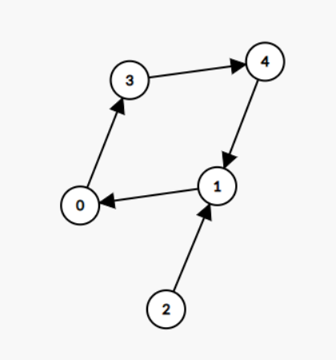
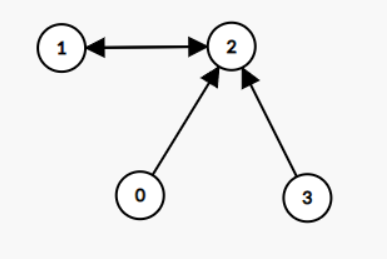
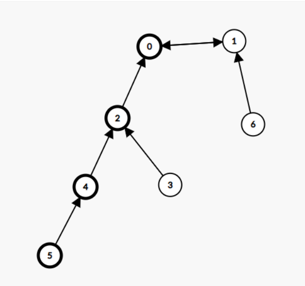

### 题目来源
[LeetCode](https://leetcode.cn/problems/maximum-employees-to-be-invited-to-a-meeting/description/?envType=daily-question&envId=2023-11-01)

### 内向基环树
一张图中有n个节点，有n条边，且每个节点的出度都为1。则该图必有一个环。 如下图所示：



其中基环由0，3，4，1组成。而2被称为树枝  
此外，基环也有可能仅包含两个节点，节点1和节点2形成基环，节点0和3都是树枝。  
    

- 在本题中，我们从节点i向favourite[i]画一条边，以表示节点i喜欢节点favourite[i]。由此可知每一个节点出度仅为1，符合内向基环树的特征。  
- 由于本题需要做到每一个上桌的人员周围至少要有一个喜欢的人才行，因此，我们需要根据内向基环树不同的类型进行考虑
  - 当基环大小大于等于3时，基环上的节点是能够坐一桌的。且所有人的同一边都有自己喜欢的人。但是此时如果插入树枝中的某个节点就会破坏这种情况。例如，节点x喜欢节点y，而此时节点z想要加入其中(*第三人真刺激*)，则会导致节点x无法坐在自己喜欢的节点旁边而失败(*我选择全都要*)。此外，如果落座的是纯树枝节点，那么必有一个节点的出度为0，即该节点喜欢的节点处于基环内，而不是树枝节点。对于其他的基环大于2的内向基环树同理。因此，此种情况只有**基环上的节点可以落座**
  - 当基环大小等于2时，以下图为例：  
    
    此时我们可以先让节点0和1落座。然后，节点6只可以在1的右边，而把节点0作为自己子孙节点的节点们只可以坐在0的左边。那么此时0的左边可以有两种选择，分别是节点3，2以及节点5，4，2。显然选择第二种情况啦(*废话，题目要求人数最多*)。为了能够找到最长的树枝，我们可以采用动态规划的方法。
    - 先设置数组`f[n]={1}`，表示以该节点为结束节点时，拥有的最长树枝数目。
    - 状态转移函数：假设节点x喜欢节点y，那么在已知`f[x]`的情况下，我们可以得到`f[y] = max{f[y], f[x] + 1}`，由此进行动态规划
  - 此外，我们还需要引入拓扑排序，帮助我们清楚所有的树枝节点。因为基环中的每一个节点其入度至少为1，哪怕把指向基环的那个树枝节点去除后，环内仍有一个节点指向该节点。
  - 但是，请**注意**当基环大小为2时，可以有个内向基环树合并在一张桌子上，即上桌的人中可能有多个基环为2的内向基环树。
  - 最后得到`max(基环大于2时的结果，基环等于2时的结果)`
  
```
c++ code
class Solution {
public:
    int maximumInvitations(vector<int>& favorite) {
        int n = favorite.size();
        vector<int> indegree(n);
        for(int i = 0; i < n; ++i)
        {
            indegree[favorite[i]]++; //入度
        }
        vector<int> used(n), f(n, 1);
        queue<int> q;
        // 拓扑开始
        for(int i = 0; i < n; ++i)
        {
            if(indegree[i] == 0)
            {
                q.push(i);  
            }
        }
        while(!q.empty())
        {
            int u = q.front();
            q.pop();
            used[u] = 1;
            int v = favorite[u];
            f[v] = max(f[v], f[u] + 1);
            indegree[v]--;
            if(indegree[v] == 0)
            {
                q.push(v);
            }
        }
        //拓扑结束
        int ring = 0, total = 0; //ring表示基环大于2的最大值，total表示基环为2的累加值
        for(int i = 0; i < n; ++i)
        {
            if(!used[i])
            {
                int j = favorite[i];
                if(favorite[j] == i)  //表示基环为2 favourite[favourite[i]] = i
                {
                    total += f[i] + f[j];
                    used[i] = 1;
                    used[j] = 1;
                }
                else
                {
                    int u = i, cnt = 0;
                    while(true)  //遍历基环，计数
                    {
                        cnt++;
                        used[u] = 1;
                        u = favorite[u]; 
                        if(u == i)
                        {
                            break;
                        }
                    }
                    ring = max(ring, cnt);
                }
            }
        }
        return max(ring, total);
    }
};

```

### 复杂度
- 时间复杂度，因为三个循环并列，所以为O(3n)即O(n)
- 空间复杂度，建立了多个大小为n的空间 所以为O(n)


### 心得
- 这件事告诉我们，当基环为2时，也就是两个人互相暗恋时，可以带动多只舔狗集合一起吃饭，顺便A饭钱。
- 多角恋也能一起吃饭*真抽象*
- *都是演员是吧*
