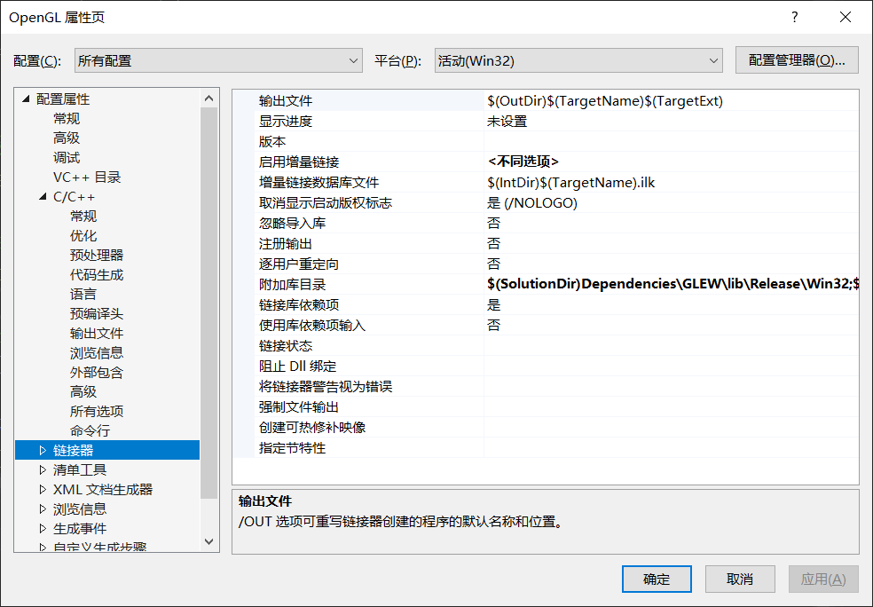
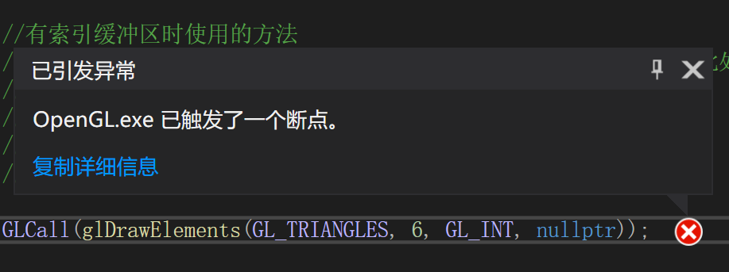
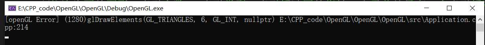

## 配置OpenGL和GLEW
- 下载指定库：GLFW和GLEW
  - GLFW：老版openGL，需要使用该库创建openGL上下文
  - GLEW：新版openGL，在上述上下文中才能够正常进行操作
- 将库复制到指定的solution文件夹(含有.sln的那个文件夹)中，并放入新建的include文件夹中便于后续管理
  - VS中选择项目名称并打开属性，在c++通用以及链接器通用中加入需要使用的头文件所在路径
  - 
```
#include<GL/glew.h> //由于内部设置，必须将该头文件置于顶部
#include <GLFW/glfw3.h>

#include<iostream>


int main(void)
{
    GLFWwindow* window;

    /* Initialize the library */
    if (!glfwInit())
        return -1;
    
    /* Create a windowed mode window and its OpenGL context */
    window = glfwCreateWindow(640, 480, "Hello World", NULL, NULL);
    if (!window)
    {
        glfwTerminate();
        return -1;
    }

    /* Make the window's context current */
    glfwMakeContextCurrent(window);

    //glew中的函数必须要处在已经建立完成的openGL的上下文中才能够正常运行
    if (glewInit() != GLEW_OK)
        std::cout << "Error" << std::endl;

    // 打印glew版本及所用驱动
    std::cout << glGetString(GL_VERSION) << std::endl;

    /* Loop until the user closes the window */
    while (!glfwWindowShouldClose(window))
    {
        /* Render here */
        glClear(GL_COLOR_BUFFER_BIT);

        //标准语法，画一个三角形并指定其三个顶点
        glBegin(GL_TRIANGLES);
        glVertex2f(-0.5f, -0.5f);
        glVertex2f(1.0f, 0.5f);
        glVertex2f(-0.5f, 1.0f);
        glEnd();


        /* Swap front and back buffers */
        glfwSwapBuffers(window);

        /* Poll for and process events */
        glfwPollEvents();
    }

    glfwTerminate();
    return 0;
}
```

##使用GLEW绘制三角形
- 需要使用**顶点缓冲区**(一系列字节存放在VRAM中)以及**着色器**(一套在GPU上执行的程序)
- 顶点缓冲区
```
    //定义顶点缓冲区 静态 由于glGenBuffers是返回void的，所以函数中还需要一个指针来指向
    //创建的缓冲区，在后续函数运行中将该指针传入，相当于该缓冲区的id
    float position[6] = {
        -0.5f, -0.5f,
         0.0f,  0.5f,
         0.5f, -0.5f
    };
    unsigned int buffer = 1;
    glGenBuffers(1, &buffer);
    glBindBuffer(GL_ARRAY_BUFFER, buffer); //声明只是一个数组
    glBufferData(GL_ARRAY_BUFFER, sizeof(position), position, GL_STATIC_DRAW); //指定缓冲区大小
    //启动顶点
    glEnableVertexAttribArray(0);
                                                                              
    //指定顶点的属性，假设顶点有位置和纹理两个属性，每个属性占8个字节
    //0：开始的位置 index， 2：位置占两个float(与后面指定类型有关)，GL_FLOAT：指定类型
    //GL_FALSE：是否标准化(映射到0-1), sizeof(float)*2：指明从当前节点到下一个节点需要经过的字节数
    //0：需要指定的属性的起点；如果指定属性是纹理，则需要改为8
    glVertexAttribPointer(0, 2, GL_FLOAT, GL_FALSE, sizeof(float) * 2, 0);
```
- 着色器
  - 顶点着色器：每一个顶点调用一次，决定顶点在屏幕上的位置
  - 片段(像素)着色器:每一个像素调用一次(光栅化)
```
static unsigned int CompileShader(unsigned int type, const std::string& source)
{
    unsigned int id = glCreateShader(type);
    const char* src = source.c_str();
    glShaderSource(id, 1, &src, nullptr);
    glCompileShader(id);

    //错误处理
    int result;
    glGetShaderiv(id, GL_COMPILE_STATUS, &result);
    if (result == GL_FALSE)
    {
        int length;
        glGetShaderiv(id, GL_INFO_LOG_LENGTH, &length);
        char* message = (char*)alloca(length * sizeof(char));
        glGetShaderInfoLog(id, length, &length, message);
        std::cout << "Failed to complie" << (type == GL_VERTEX_SHADER ? "vertex" : "fragment") << "shader" << std::endl;
        std::cout << message << std::endl;
        glDeleteShader(id);
        return 0;
    }

    return id;
}

static unsigned int CreateShader(const std::string& vertexshader, const std::string& fragmentshader)
{
    unsigned int program = glCreateProgram();
    unsigned int vs = CompileShader(GL_VERTEX_SHADER, vertexshader);
    unsigned int fs = CompileShader(GL_FRAGMENT_SHADER, fragmentshader);

    //附加与链接
    glAttachShader(program, vs);
    glAttachShader(program, fs);
    glLinkProgram(program);
    glValidateProgram(program);

    //删除着色器
    glDeleteShader(vs);
    glDeleteShader(fs);

    return program;
}

...在openGL的while循环前编写简单着色器，指定位置以及颜色
//location=0与前面glVertexAttribPointer的第一个0相对应
//哪怕提取出来的是二维的 应该写成vec2但是由于下面gl_Position只接受vec4，所以不如提前提取成vec4的形式
std::string vertexShader =
        "#version 330 core\n"
        "\n"
        "layout(location = 0) in vec4 position;\n"
        "\n"
        "void main()\n"
        "{\n"
        "   gl_Position = position;\n"
        "}\n";

    std::string fragmentShader =
        "#version 330 core\n"
        "\n"
        "layout(location = 0) out vec4 color;\n"
        "\n"
        "void main()\n"
        "{\n"
        "   color = vec4(1.0, 0.0, 0.0, 1.0);\n"
        "}\n";

    unsigned int shader = CreateShader(vertexShader, fragmentShader);
    glUseProgram(shader);
```

## 处理着色器
- 将上一节的着色器字符串写入一个文件，并在主文件中使用fstream读取
- 读取字符串后需要进行保存，使用sstream保存成数组
- 建立枚举类，方便访问数组，以及后续编写和阅读(名字对应下标)
```
#include<string>
#include<sstream>

struct ShaderProgrameSource
{
    std::string VertexSource;
    std::string FragmentSource;
};

static ShaderProgrameSource ParseShader(const std::string& filepath)
{
    std::ifstream stream(filepath);
    std::string line;

    //枚举类，方便后续代码书写和阅读以及存入对应的shader
    enum class ShaderType
    {
        NONE = -1, VERTEX = 0, FRAGMENT = 1
    };

    //对字符串进行输入输出操作
    std::stringstream ss[2];
    ShaderType type = ShaderType::NONE;

    while (getline(stream, line))
    {
        //find返回字符串第一个出现的位置，npos表示没找到
        if (line.find("shader") != std::string::npos)
        {
            if (line.find("vertex") != std::string::npos)
            {
                //set mode vertex
                type = ShaderType::VERTEX;
            }
            else if (line.find("fragment") != std::string::npos)
            {
                //set mode fragment
                type = ShaderType::FRAGMENT;
            }
        }
        else
        {
            //加入换行符后加入对应数组
            ss[(int)type] << line << '\n';
        }
    }
    return { ss[0].str(), ss[1].str()};
}
```

##索引缓冲区
- 可以重用顶点，避免显存浪费
- **索引缓冲区类型必须是`unsigned int`**
- 使用索引缓冲区之前，也必须要指定`position`数组缓冲区，且启动顶点以及指定顶点属性，然后再创建索引缓冲区
- 将原先使用`position`绘画的指令`glDrawArrays`改为`glDrawElements`
```
    //所有索引缓冲区类型必须是unsigned int
    unsigned int indices[2 * 3] = {
        0, 1, 2,
        2, 3, 0
    };

    ...
    
    //索引缓冲区
    unsigned int ibo = 1;
    glGenBuffers(1, &ibo);
    glBindBuffer(GL_ELEMENT_ARRAY_BUFFER, ibo); //声明只是一个数组
    glBufferData(GL_ELEMENT_ARRAY_BUFFER, 2 * 3 * sizeof(unsigned int), indices, GL_STATIC_DRAW);

    ...

    //有索引缓冲区时使用的方法
    //依次为画的图形，索引个数， 索引类型，索引缓冲区的指针，由于此处只有一个索引缓冲区
    //且已经绑定，可以不传指针
    glDrawElements(GL_TRIANGLES, 6, GL_UNSIGNED_INT, nullptr);

```

## 处理错误
- 使用glGetError获得 ，从openGL1.1开始就有，仅给一个错误码，需要循环调用，以获得所有的错误
- glDebugMessageCallback，从openGL4.3开始，解释较为详细
- 灵活使用宏，减少书写重复代码，甚至可以加入出错的函数名，所在文件以及行数




```
//宏，如果为false则调用断点函数，该函数随编译器的不同而不同，此处为MSVC
#define ASSERT(x) if (!(x)) __debugbreak();

//\为转义符后面不能加任何东西，否则会出错
//最后不需要加;,因为使用GLCall(x)后就是以;结尾
//加#可以转成字符串， __FILE__和__LINE__都应该是所有编译器支持的
#define GLCall(x) GLCleanError();\
    x;\
    ASSERT(GLLogCall(#x, __FILE__, __LINE__))

static void GLCleanError()
{
    while (glGetError() != GL_NO_ERROR);
}

static bool GLLogCall()
{
    while (GLenum error = glGetError())
    {
        std::cout << "[openGL Error] (" << error << ")" << std::endl;
        return false;
    }
    return true;
}

...

GLCleanError(); //确保前面没有任何错误
glDrawElements(GL_TRIANGLES, 6, GL_INT, nullptr);
ASSERT(GLLogCall()); //确保错误来自上述函数

//或采用宏
GLCall(glDrawElements(GL_TRIANGLES, 6, GL_INT, nullptr));

```


## 统一变量
- 每一次绘制都需要设置一次，可以在调用`glDrawArrays`和`glDrawElements`或其他任何绘制函数之前设置
- 而**属性**则只需要设置一次，比如：点的位置
- 需要在shaders文件中声明统一变量

```
uniform vec4 u_Color;

void main()
{
	color = u_Color;
};
```
- 在项目绑定着色器后，指定着色器和尝试获取的统一变量

```
GLCall(glUseProgram(shader));
//指定着色器(获得对应着色器的location)和尝试获取的统一变量
GLCall(int location = glGetUniformLocation(shader, "u_Color"));
ASSERT(location != -1); //openGL会把不用的变量直接删除，导致出现-1的情况
GLCall(glUniform4f(location, 0.2f, 0.3f, 0.8f, 1.0f));
```
- 可以在绘制函数调用前或后进行统一变量的更新

```
float r = 0.0f;
float increment = 0.05f;
...
{
    ...
    GLCall(glDrawElements(GL_TRIANGLES, 6, GL_UNSIGNED_INT, nullptr));

    GLCall(glUniform4f(location, r, 0.3f, 0.8f, 1.0f));
    if (r > 1.0f)
    {
        increment = -0.05f;
    }
    else if (r < 0.0f)
    {
        increment = 0.05f;
    }
    r += increment;
}
```
- 可以在创建上下文函数之后设置画面帧率
```
//设定画面帧率,应该为垂直同步或者是主频的刷新率
//数字越小，刷新越快，反之，越慢
    glfwSwapInterval(1);
```