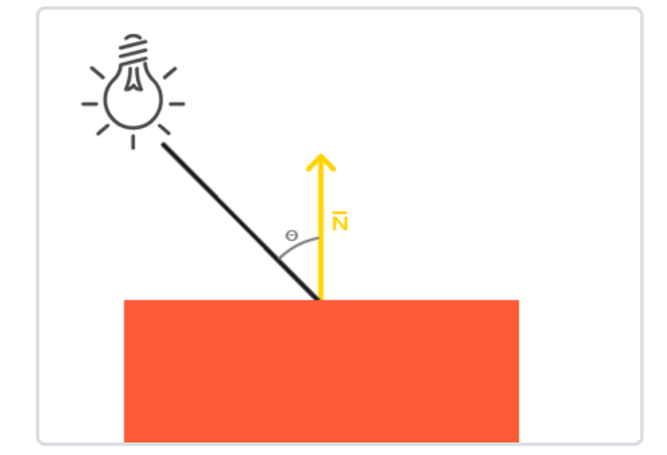
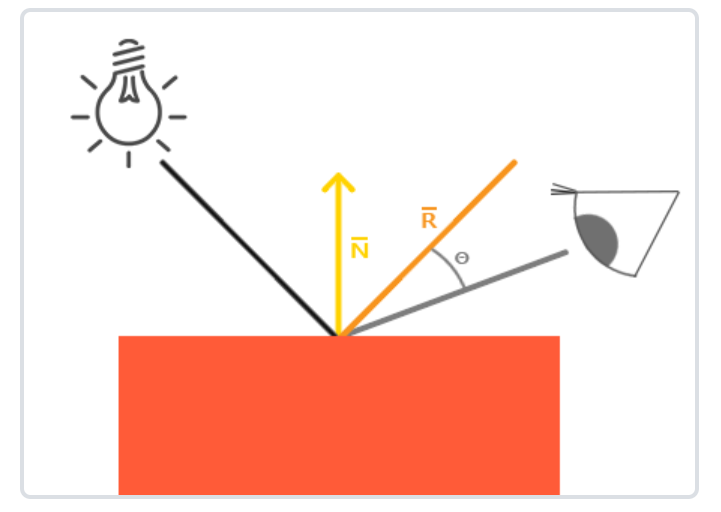
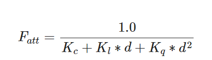

## 光照
### 冯氏光照模型
- 主要结构 = 环境光照(Amibent) + 漫反射(Diffuse) + 镜面反射(Specular)
#### 环境光照(Amibent)：
- 将光的颜色乘以一个环境因子(AmbientStrength)再乘以物体颜色
    ```
    float ambientStrength = 0.1;
    vec3 ambient = ambientStrength * lightColor;

    vec3 result = ambient * objectColor;
    FragColor = vec4(result, 1.0);
    ```

#### 漫反射(Diffuse)：

- 法向量(Normal)：垂直于顶点表面向外的vec3单位向量(对于简单的立方体来说，使用叉乘对立方体所有顶点计算法向量)；如果对物体进行了不规则的放大缩小会导致法向量与改变大小的物体实际法向量不符，需要进行变化，将**model的前面3*3区域的矩阵求逆并转置再乘以原始Normal**即可获得符合改变大小后的物体的实际法向量
- 定向光线(LightDir)：
    - 对于**平行光**：直接对其光的方向取反即可；(因为光的方向定义为从光指向片段位置)
    - 对于**点光源**和**聚光**: 通过光位置减去片段位置(顶点的世界坐标，乘以model即可)再进行标准化即可获得**从片段位置指向光位置的单位向量**
- 对Normal和LightDir进行点乘，计算光源对物体的影响度；数值越大，则代表光源直射该物体，对其影响越大(亮度越明显)
    ```
    //vs
    Normal = mat3(transpose(inverse(model))) * aNormal; //考虑到物体的不规则放大缩小，法向量会发生改变


    vec3 norm = normalize(Normal);
    vec3 lightDir = normalize(lightPos - FragPos);
    float diff = max(dot(norm, lightDir), 0.0);
    vec3 diffuse = diff * lightColor;
    vec3 result = diffuse * objectColor;

    ```

#### 镜面反射(Specular)

- 法向量(Normal)：同上
- 定向光线(LightDir)：同上
- 观测点(ViewPos)：直接获得摄像机的位置即可(或者在View空间，则{0,0,0}即为摄像机位置;获得view空间坐标需要在世界坐标的基础上再乘以View矩阵)
- 镜面强度(Specular Insensity)：float型，数值越大，越亮
- 反射方向(ReflectDir)：即为图中的橙色光线，使用reflect(-lightDir, Normal)进行计算即可
    ```
    vec3 viewDir = normalize(viewPos - FragPos);
    vec3 reflectDir = reflect(-lightDir, norm);
    float spec = pow(max(dot(viewDir, reflectDir), 0.0), 32);   //32代表高光反光度，数值越高，反光越强，散射越小
    vec3 specular = specularStrength * spec * lightColor;
    vec3 result = specular * objectColor;
    ```

#### 缺点
- 能量不守恒，如果有多个光源同时照射到同一物体上时，其环境光照为这几个光源的和导致亮度过高


### 光照贴图
- 漫反射贴图：就是纹理(Texture)，通过对其进行采样就能够生成准确的画面
- 镜面光贴图：黑白的纹理，黑白的程度定义每一个部分镜面光强度
    ```
    struct Material {
        sampler2D diffuse;
        sampler2D specular;
        float     shininess;
    };

    uniform Material material;  //外部传入，且必须通过单独设置对应的变量才行，例如SetInt("material.diffuse", 1);

    vec3 ambient  = light.ambient  * vec3(texture(material.diffuse, TexCoords));
    vec3 diffuse  = light.diffuse  * diff * vec3(texture(material.diffuse, TexCoords));  
    vec3 specular = light.specular * spec * vec3(texture(material.specular, TexCoords));
    FragColor = vec4(ambient + diffuse + specular, 1.0);
    ```

### 光源

#### 平行光：
```
struct Light {
    vec3 direction; //计算LightDir只需要对dircetion取反即可

    vec3 ambient;
    vec3 diffuse;
    vec3 specular;
};
```

#### 点光源：
- 考虑光线衰减(Attenuation)，按下式计算衰减值，使得该光线在刚开始时衰减不厉害(其中$d$为光源与片段之间的距离)，超过一定范围后迅速衰减

[附衰减表](https://wiki.ogre3d.org/tiki-index.php?page=-Point+Light+Attenuation)

```
struct Light {
    vec3 position;  

    vec3 ambient;
    vec3 diffuse;
    vec3 specular;

    float constant;     //衰减常数项
    float linear;       //衰减一次项
    float quadratic;    //二次项
};

void main()
{
    ...
    float distance    = length(light.position - FragPos);
    float attenuation = 1.0 / (light.constant + light.linear * distance + light.quadratic * (distance * distance));
    ...
    ambient  *= attenuation; 
    diffuse  *= attenuation;
    specular *= attenuation;
    ...
}
```