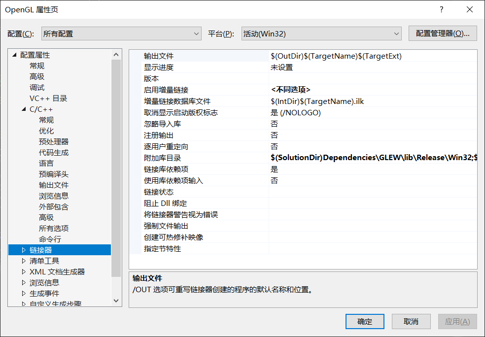
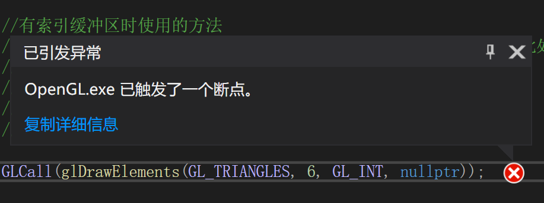
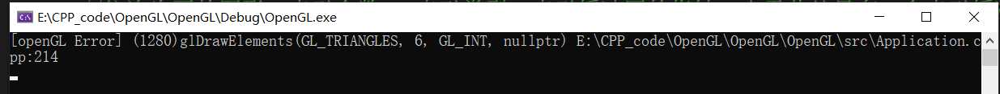
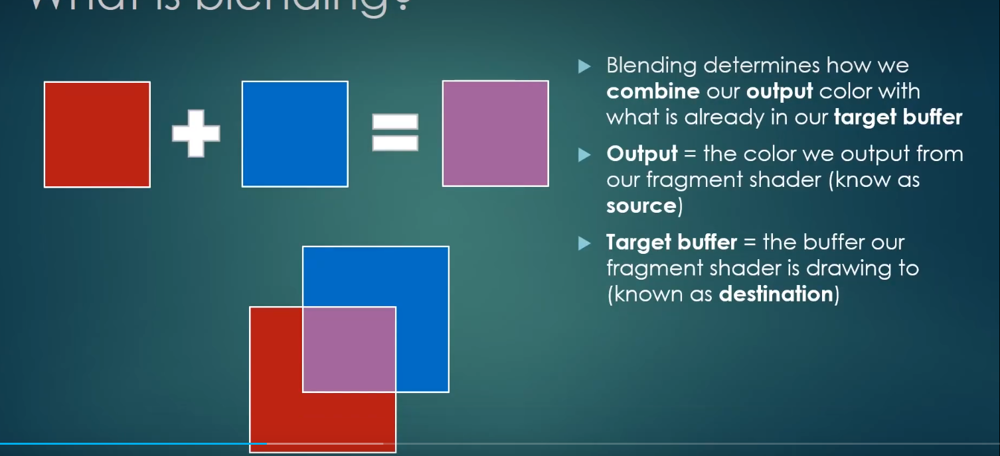
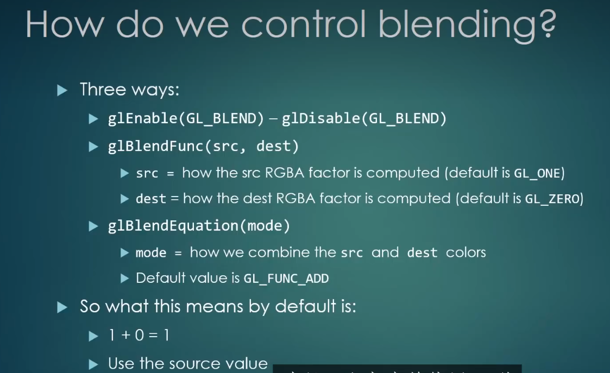
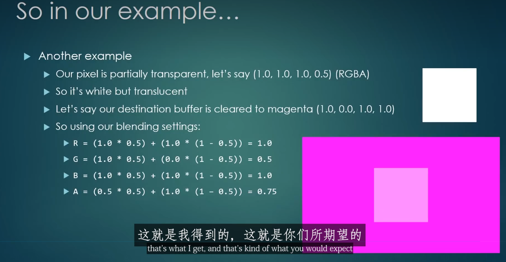

## 配置OpenGL和GLEW
- 下载指定库：GLFW和GLEW
  - GLFW：老版openGL，需要使用该库创建openGL上下文
  - GLEW：新版openGL，在上述上下文中才能够正常进行操作
- 将库复制到指定的solution文件夹(含有.sln的那个文件夹)中，并放入新建的include文件夹中便于后续管理
  - VS中选择项目名称并打开属性，在c++通用以及链接器通用中加入需要使用的头文件所在路径
  - 
```
#include<GL/glew.h> //由于内部设置，必须将该头文件置于顶部
#include <GLFW/glfw3.h>

#include<iostream>


int main(void)
{
    GLFWwindow* window;

    /* Initialize the library */
    if (!glfwInit())
        return -1;
    
    /* Create a windowed mode window and its OpenGL context */
    window = glfwCreateWindow(640, 480, "Hello World", NULL, NULL);
    if (!window)
    {
        glfwTerminate();
        return -1;
    }

    /* Make the window's context current */
    glfwMakeContextCurrent(window);

    //glew中的函数必须要处在已经建立完成的openGL的上下文中才能够正常运行
    if (glewInit() != GLEW_OK)
        std::cout << "Error" << std::endl;

    // 打印glew版本及所用驱动
    std::cout << glGetString(GL_VERSION) << std::endl;

    /* Loop until the user closes the window */
    while (!glfwWindowShouldClose(window))
    {
        /* Render here */
        glClear(GL_COLOR_BUFFER_BIT);

        //标准语法，画一个三角形并指定其三个顶点
        glBegin(GL_TRIANGLES);
        glVertex2f(-0.5f, -0.5f);
        glVertex2f(1.0f, 0.5f);
        glVertex2f(-0.5f, 1.0f);
        glEnd();


        /* Swap front and back buffers */
        glfwSwapBuffers(window);

        /* Poll for and process events */
        glfwPollEvents();
    }

    glfwTerminate();
    return 0;
}
```

##使用GLEW绘制三角形
- 需要使用**顶点缓冲区**(一系列字节存放在VRAM中)以及**着色器**(一套在GPU上执行的程序)
- 顶点缓冲区
```
    //定义顶点缓冲区 静态 由于glGenBuffers是返回void的，所以函数中还需要一个指针来指向
    //创建的缓冲区，在后续函数运行中将该指针传入，相当于该缓冲区的id
    float position[6] = {
        -0.5f, -0.5f,
         0.0f,  0.5f,
         0.5f, -0.5f
    };
    unsigned int buffer = 1;
    glGenBuffers(1, &buffer);
    glBindBuffer(GL_ARRAY_BUFFER, buffer); //声明只是一个数组
    glBufferData(GL_ARRAY_BUFFER, sizeof(position), position, GL_STATIC_DRAW); //指定缓冲区大小
    //启动顶点
    glEnableVertexAttribArray(0);
                                                                              
    //指定顶点的属性，假设顶点有位置和纹理两个属性，每个属性占8个字节
    //0：开始的位置 index， 2：位置占两个float(与后面指定类型有关)，GL_FLOAT：指定类型
    //GL_FALSE：是否标准化(映射到0-1), sizeof(float)*2：指明从当前节点到下一个节点需要经过的字节数
    //0：需要指定的属性的起点；如果指定属性是纹理，则需要改为8
    glVertexAttribPointer(0, 2, GL_FLOAT, GL_FALSE, sizeof(float) * 2, 0);
```
- 着色器
  - 顶点着色器：每一个顶点调用一次，决定顶点在屏幕上的位置
  - 片段(像素)着色器:每一个像素调用一次(光栅化)
```
static unsigned int CompileShader(unsigned int type, const std::string& source)
{
    unsigned int id = glCreateShader(type);
    const char* src = source.c_str();
    glShaderSource(id, 1, &src, nullptr);
    glCompileShader(id);

    //错误处理
    int result;
    glGetShaderiv(id, GL_COMPILE_STATUS, &result);
    if (result == GL_FALSE)
    {
        int length;
        glGetShaderiv(id, GL_INFO_LOG_LENGTH, &length);
        char* message = (char*)alloca(length * sizeof(char));
        glGetShaderInfoLog(id, length, &length, message);
        std::cout << "Failed to complie" << (type == GL_VERTEX_SHADER ? "vertex" : "fragment") << "shader" << std::endl;
        std::cout << message << std::endl;
        glDeleteShader(id);
        return 0;
    }

    return id;
}

static unsigned int CreateShader(const std::string& vertexshader, const std::string& fragmentshader)
{
    unsigned int program = glCreateProgram();
    unsigned int vs = CompileShader(GL_VERTEX_SHADER, vertexshader);
    unsigned int fs = CompileShader(GL_FRAGMENT_SHADER, fragmentshader);

    //附加与链接
    glAttachShader(program, vs);
    glAttachShader(program, fs);
    glLinkProgram(program);
    glValidateProgram(program);

    //删除着色器
    glDeleteShader(vs);
    glDeleteShader(fs);

    return program;
}

...在openGL的while循环前编写简单着色器，指定位置以及颜色
//location=0与前面glVertexAttribPointer的第一个0相对应
//哪怕提取出来的是二维的 应该写成vec2但是由于下面gl_Position只接受vec4，所以不如提前提取成vec4的形式
std::string vertexShader =
        "#version 330 core\n"
        "\n"
        "layout(location = 0) in vec4 position;\n"
        "\n"
        "void main()\n"
        "{\n"
        "   gl_Position = position;\n"
        "}\n";

    std::string fragmentShader =
        "#version 330 core\n"
        "\n"
        "layout(location = 0) out vec4 color;\n"
        "\n"
        "void main()\n"
        "{\n"
        "   color = vec4(1.0, 0.0, 0.0, 1.0);\n"
        "}\n";

    unsigned int shader = CreateShader(vertexShader, fragmentShader);
    glUseProgram(shader);
```

## 处理着色器
- 将上一节的着色器字符串写入一个文件，并在主文件中使用fstream读取
- 读取字符串后需要进行保存，使用sstream保存成数组
- 建立枚举类，方便访问数组，以及后续编写和阅读(名字对应下标)
```
#include<string>
#include<sstream>

struct ShaderProgrameSource
{
    std::string VertexSource;
    std::string FragmentSource;
};

static ShaderProgrameSource ParseShader(const std::string& filepath)
{
    std::ifstream stream(filepath);
    std::string line;

    //枚举类，方便后续代码书写和阅读以及存入对应的shader
    enum class ShaderType
    {
        NONE = -1, VERTEX = 0, FRAGMENT = 1
    };

    //对字符串进行输入输出操作
    std::stringstream ss[2];
    ShaderType type = ShaderType::NONE;

    while (getline(stream, line))
    {
        //find返回字符串第一个出现的位置，npos表示没找到
        if (line.find("shader") != std::string::npos)
        {
            if (line.find("vertex") != std::string::npos)
            {
                //set mode vertex
                type = ShaderType::VERTEX;
            }
            else if (line.find("fragment") != std::string::npos)
            {
                //set mode fragment
                type = ShaderType::FRAGMENT;
            }
        }
        else
        {
            //加入换行符后加入对应数组
            ss[(int)type] << line << '\n';
        }
    }
    return { ss[0].str(), ss[1].str()};
}
```

##索引缓冲区
- 可以重用顶点，避免显存浪费
- **索引缓冲区类型必须是`unsigned int`**
- 使用索引缓冲区之前，也必须要指定`position`数组缓冲区，且启动顶点以及指定顶点属性，然后再创建索引缓冲区
- 将原先使用`position`绘画的指令`glDrawArrays`改为`glDrawElements`
```
    //所有索引缓冲区类型必须是unsigned int
    unsigned int indices[2 * 3] = {
        0, 1, 2,
        2, 3, 0
    };

    ...
    
    //索引缓冲区
    unsigned int ibo = 1;
    glGenBuffers(1, &ibo);
    glBindBuffer(GL_ELEMENT_ARRAY_BUFFER, ibo); //声明只是一个数组
    glBufferData(GL_ELEMENT_ARRAY_BUFFER, 2 * 3 * sizeof(unsigned int), indices, GL_STATIC_DRAW);

    ...

    //有索引缓冲区时使用的方法
    //依次为画的图形，索引个数， 索引类型，索引缓冲区的指针，由于此处只有一个索引缓冲区
    //且已经绑定，可以不传指针
    glDrawElements(GL_TRIANGLES, 6, GL_UNSIGNED_INT, nullptr);

```

## 处理错误
- 使用glGetError获得 ，从openGL1.1开始就有，仅给一个错误码，需要循环调用，以获得所有的错误
- glDebugMessageCallback，从openGL4.3开始，解释较为详细
- 灵活使用宏，减少书写重复代码，甚至可以加入出错的函数名，所在文件以及行数




```
//宏，如果为false则调用断点函数，该函数随编译器的不同而不同，此处为MSVC
#define ASSERT(x) if (!(x)) __debugbreak();

//\为转义符后面不能加任何东西，否则会出错
//最后不需要加;,因为使用GLCall(x)后就是以;结尾
//加#可以转成字符串， __FILE__和__LINE__都应该是所有编译器支持的
#define GLCall(x) GLCleanError();\
    x;\
    ASSERT(GLLogCall(#x, __FILE__, __LINE__))

static void GLCleanError()
{
    while (glGetError() != GL_NO_ERROR);
}

static bool GLLogCall()
{
    while (GLenum error = glGetError())
    {
        std::cout << "[openGL Error] (" << error << ")" << std::endl;
        return false;
    }
    return true;
}

...

GLCleanError(); //确保前面没有任何错误
glDrawElements(GL_TRIANGLES, 6, GL_INT, nullptr);
ASSERT(GLLogCall()); //确保错误来自上述函数

//或采用宏
GLCall(glDrawElements(GL_TRIANGLES, 6, GL_INT, nullptr));

```


## 统一变量
- 每一次绘制都需要设置一次，可以在调用`glDrawArrays`和`glDrawElements`或其他任何绘制函数之前设置
- 而**属性**则只需要设置一次，比如：点的位置
- 需要在shaders文件中声明统一变量

```
uniform vec4 u_Color;

void main()
{
	color = u_Color;
};
```
- 在项目绑定着色器后，指定着色器和尝试获取的统一变量

```
GLCall(glUseProgram(shader));
//指定着色器(获得对应着色器的location)和尝试获取的统一变量
GLCall(int location = glGetUniformLocation(shader, "u_Color"));
ASSERT(location != -1); //openGL会把不用的变量直接删除，导致出现-1的情况
GLCall(glUniform4f(location, 0.2f, 0.3f, 0.8f, 1.0f));
```
- 可以在绘制函数调用前或后进行统一变量的更新

```
float r = 0.0f;
float increment = 0.05f;
...
{
    ...
    GLCall(glDrawElements(GL_TRIANGLES, 6, GL_UNSIGNED_INT, nullptr));

    GLCall(glUniform4f(location, r, 0.3f, 0.8f, 1.0f));
    if (r > 1.0f)
    {
        increment = -0.05f;
    }
    else if (r < 0.0f)
    {
        increment = 0.05f;
    }
    r += increment;
}
```
- 可以在创建上下文函数之后设置画面帧率
```
//设定画面帧率,应该为垂直同步或者是主频的刷新率
//数字越小，刷新越快，反之，越慢
    glfwSwapInterval(1);
```

## 顶点数组对象(VAO)
- 在DirectX等其他渲染接口中并不真正存在，是openGL独有的或者说是它的一个原始接口
- 是一种通过一种特定规范绑定顶点缓冲区的方式
- 如果需要绘制多个对象，则需要绑定顶点缓冲区，绑定索引缓冲区，然后绘制
- 如果有多个对象，则需要每次都重新绑定需要绘制的所有东西，即需要在while循环中每次都进行绑定操作(绑定着色器、顶点缓冲区、索引缓冲区);只需要更换着色器、两个缓冲区就可以实现绘制不同对象了

```
{
    ...
    //绑定着色器、顶点缓冲区、索引缓冲区
    GLCall(glUseProgram(shader));
    GLCall(glUniform4f(location, r, 0.3f, 0.8f, 1.0f));
    GLCall(glBindBuffer(GL_ARRAY_BUFFER, buffer));
    GLCall(glEnableVertexAttribArray(0));
    GLCall(glVertexAttribPointer(0, 2, GL_FLOAT, GL_FALSE, sizeof(float) * 2, 0));
    GLCall(glBindBuffer(GL_ELEMENT_ARRAY_BUFFER, ibo));
    ...
}
```
- 虽然此处并没有显式创建VAO，但是openGL的兼容性配置文件(compatibility profile)已经帮我们创建了一个VAO，(猜测为`glEnableVertexAttribArray(0)`中的0即为隐式创建的VAO的索引)
- 但是核心配置文件(core profile)并不会创建，需要手动创建，之后可以移除上述代码块中的绑定顶点缓冲区，激活顶点以及指定顶点操作
- 原理：
  - 绑定VAO(`glBindVertexArray(vao)`)和绑定顶点缓冲区(`glBindBuffer(GL_ARRAY_BUFFER, buffer)`)时，实际上没有东西去链接这两个
  - `glVertexAttribPointer(0, 2, GL_FLOAT, GL_FALSE, sizeof(float) * 2, 0)`中的第一个0其实就是将顶点缓冲区索引为0的位置绑定到了`GL_ARRAY_BUFFER`中，当需要绑定其他顶点缓冲区时，只需要将0变为其他值即可

```
//在创建缓冲区前，创建VAO
//创建一个VAO
unsigned int vao;
GLCall(glGenVertexArrays(1, &vao));
GLCall(glBindVertexArray(vao));

...

{
    ...

    GLCall(glUseProgram(shader));
    GLCall(glUniform4f(location, r, 0.3f, 0.8f, 1.0f));
    GLCall(glBindVertexArray(vao));
    GLCall(glBindBuffer(GL_ELEMENT_ARRAY_BUFFER, ibo));
}    
```
- 可以设置一个全局VAO将所有对象循环绑定，或者为每一个对象创建一个VAO


## 将以上方法抽象成类
- 将报错检测抽象成`Renderer`类，包括ASSERT、CLCall、GLCleanError、GLLogCall
- 将VertexBuffer和IndexBuffer抽象成类，在构造函数中创建缓冲区，Bind中进行绑定，UnBind中解绑
- 值得注意的是，抽象之后，openGL会存在bug。当关闭绘图窗口，程序并不会停止，而是会在GLCleanError循环。
  - 这是因为在关闭绘图窗口后，就失去了有效的openGL上下文和GLGetError，然后就会执行`while (glGetError() != GL_NO_ERROR);`；此时有两种方法，一种是创建缓冲区时使用new分配，在`glfwTerminate();`前delete掉它们。另外一种是在glfw的作用域中额外增加一个作用域，并将代码置于其中


##将VAO抽象成类
- 需要创建一个`VertexBufferLayout`类用来存储不同VertexBuffer的布局，例如：需要绘制的顶点的大小，属性、绘制下一个顶点需要的步长等，代码如下
  - `VertexBufferElement`只是为了进行vector存储的时候方便而创建的一个类，用来存储VertexBuffer的布局，为`GLCall(glVertexAttribPointer());`做准备，用来指定顶点的属性
  - 后续的模板函数也只是为了进行存储的时候方便进行，如有需要可以增加对应模板 例如考虑void类 int类等等
  - 最后就需要返回`m_Elements`和`m_Stride`方便后续激活顶点属性

```
struct VertexBufferElement
{
	unsigned int type;
	unsigned int count;
	unsigned char normalized;

	static unsigned int GetSizeOfType(unsigned int type)
	{
		switch (type)
		{
			case GL_FLOAT:			return 4;
			case GL_UNSIGNED_INT:	return 4;
			case GL_UNSIGNED_BYTE:	return 1;
		}
		ASSERT(false);
		return 0;
	}
};

class VertexBufferLayout 
{
private:
	std::vector<VertexBufferElement> m_Elements;
	unsigned int m_Stride;

public:
	VertexBufferLayout()
		: m_Stride(0) {}

	template<typename T>
	void Push(unsigned int count)
	{
		static_assert(false);
	}

	template<>
	void Push<float>(unsigned int count)
	{
		m_Elements.push_back({ GL_FLOAT, count, GL_FALSE });
		m_Stride += VertexBufferElement::GetSizeOfType(GL_FLOAT) * count;
	}

	template<>
	void Push<unsigned int>(unsigned int count)
	{
		m_Elements.push_back({ GL_UNSIGNED_INT, count, GL_FALSE });
		m_Stride += VertexBufferElement::GetSizeOfType(GL_UNSIGNED_INT) * count;
	}

	template<>
	void Push<unsigned char>(unsigned int count)
	{
		m_Elements.push_back({ GL_UNSIGNED_BYTE, count, GL_TRUE });
		m_Stride += VertexBufferElement::GetSizeOfType(GL_UNSIGNED_BYTE) * count;
	}

	inline const std::vector<VertexBufferElement>& GetElements() const { return m_Elements; }
	inline unsigned int GetStride() const { return m_Stride; }
};
```
- 创建一个`VertexArray`类
  - 构造函数、析构函数以及Bind和UnBind函数都与VertexBuffer和IndexBuffer的实现方式差不多
  - 着重看`AddBuffer`。读取layout的`elements`，获取VertexBuffer的布局，然后直接调用`GLCall(glVertexAttribPointer());`即可
```
void VertexArray::AddBuffer(const VertexBuffer& vb, const VertexBufferLayout& layout)
{
	vb.Bind();

    const auto& elements = layout.GetElements();
    unsigned int offset = 0;
    for (unsigned int i = 0; i < elements.size(); ++i)
    {
        Bind();
        const auto& element = elements[i];

        //启动顶点
        GLCall(glEnableVertexAttribArray(0));

        //i：指明绘制的通用顶点的索引
        //count和type：一个顶点所占用的大小。例如-0.5f,-0.5f就是count=2，type=GL_FLOAT
        //normalized：是否标准化，一般都是针对字节使用true，其他为false不采用
        //stride：当前顶点到下一个顶点需要经过的字节大小，其实就是一个节点的大小
        //offset：指定属性的起点，例如现在一个顶点存储了4个字节的位置信息和4个字节的材质信息，如果我只需要提取位置信息，则设为0，若需要提取材质信息则设为4
        GLCall(glVertexAttribPointer(i, element.count, element.type, 
            element.normalized, layout.GetStride(), (const void*)offset));
        offset += element.count * VertexBufferElement::GetSizeOfType(element.type);

    }

}
```

##将着色器抽象成类
- `Shader`中的`m_FilePath`仅供调试用，也可以不设置；而`m_UniformLocationCache`则是为了减少执行`GetUniformLocation`的次数以提高性能
```
struct ShaderProgrameSource
{
	std::string VertexSource;
	std::string FragmentSource;
};

class Shader
{
private:
	std::string m_FilePath;	//打印，为了知道着色器所属的文件
	unsigned int m_RendererID;
	//为了防止GetUniformLocation重复执行(每一帧都会执行),采用哈希表进行缓存
	std::unordered_map<std::string, int> m_UniformLocationCache;
public:
	Shader(const std::string& filepath);
	~Shader();

	void Bind() const;
	void UnBind() const;

	//set uniforms
	void SetUniform4f(const std::string& name, float v0, float v1, float f2, float f3);

private:
	ShaderProgrameSource ParseShader(const std::string& filepath);
	unsigned int CompileShader(unsigned int type, const std::string& source);
	unsigned int CreateShader(const std::string& vertexshader, const std::string& fragmentshader);
	unsigned int GetUniformLocation(const std::string& name);
};
```
- `ParseShader, ComplieShader, 以及CreateShader`都与先前Application文件中的一致，剩余的函数也均是从Application中进行了参数名更改获得的
```
Shader::Shader(const std::string& filepath)
	:m_FilePath(filepath), m_RendererID(0)
{
    ShaderProgrameSource sps = ParseShader(filepath);
    m_RendererID = CreateShader(sps.VertexSource, sps.FragmentSource);
}

Shader::~Shader()
{
    GLCall(glDeleteProgram(m_RendererID));
}


ShaderProgrameSource Shader::ParseShader(const std::string& filepath)
{
    std::ifstream stream(filepath);
    std::string line;

    //枚举类，方便后续代码书写和阅读以及存入对应的shader
    enum class ShaderType
    {
        NONE = -1, VERTEX = 0, FRAGMENT = 1
    };

    //对字符串进行输入输出操作
    std::stringstream ss[2];
    ShaderType type = ShaderType::NONE;

    while (getline(stream, line))
    {
        //find返回字符串第一个出现的位置，npos表示没找到
        if (line.find("shader") != std::string::npos)
        {
            if (line.find("vertex") != std::string::npos)
            {
                //set mode vertex
                type = ShaderType::VERTEX;
            }
            else if (line.find("fragment") != std::string::npos)
            {
                //set mode fragment
                type = ShaderType::FRAGMENT;
            }
        }
        else
        {
            //加入换行符后加入对应数组
            ss[(int)type] << line << '\n';
        }
    }
    return { ss[0].str(), ss[1].str() };
}

unsigned int Shader::CompileShader(unsigned int type, const std::string& source)
{
    unsigned int id = glCreateShader(type);
    const char* src = source.c_str();
    GLCall(glShaderSource(id, 1, &src, nullptr));
    GLCall(glCompileShader(id));

    //错误处理
    int result;
    GLCall(glGetShaderiv(id, GL_COMPILE_STATUS, &result));
    if (result == GL_FALSE)
    {
        int length;
        GLCall(glGetShaderiv(id, GL_INFO_LOG_LENGTH, &length));
        char* message = (char*)alloca(length * sizeof(char));
        GLCall(glGetShaderInfoLog(id, length, &length, message));
        std::cout << "Failed to complie" << (type == GL_VERTEX_SHADER ? "vertex" : "fragment") << "shader" << std::endl;
        std::cout << message << std::endl;
        GLCall(glDeleteShader(id));
        return 0;
    }

    return id;
}

unsigned int Shader::CreateShader(const std::string& vertexshader, const std::string& fragmentshader)
{
    unsigned int program = glCreateProgram();
    unsigned int vs = CompileShader(GL_VERTEX_SHADER, vertexshader);
    unsigned int fs = CompileShader(GL_FRAGMENT_SHADER, fragmentshader);

    //附加与链接
    GLCall(glAttachShader(program, vs));
    GLCall(glAttachShader(program, fs));
    GLCall(glLinkProgram(program));
    GLCall(glValidateProgram(program));

    //删除着色器
    GLCall(glDeleteShader(vs));
    GLCall(glDeleteShader(fs));

    return program;
}

void Shader::Bind() const
{
    GLCall(glUseProgram(m_RendererID));
}

void Shader::UnBind() const
{
    GLCall(glUseProgram(0));

}

void Shader::SetUniform4f(const std::string& name, float v0, float v1, float v2, float v3)
{
    GLCall(glUniform4f(GetUniformLocation(name), v0, v1, v2, v3));
}

unsigned int Shader::GetUniformLocation(const std::string& name)
{
    if (m_UniformLocationCache.find(name) != m_UniformLocationCache.end())
        return m_UniformLocationCache[name];

    GLCall(int location = glGetUniformLocation(m_RendererID, name.c_str()));
    //location=-1 代表没有统一变量或者统一变量已经声明了但是还没用
    //在实际调试中，并不想因为这个而暂停运行，所以不用ASSERT
    if (location == -1)
        std::cout << "Warning: uniform" << name << "doesn't exist!" << std::endl;
    m_UniformLocationCache[name] = location;
	return location;
}
```

##编写renderer
- 在openGL中解绑可能会导致性能下降，因为后面会重新进行Bind
- 将openGL上下文中，将进行`VertexArray,IndexBuffer,Shader`的绑定置于Renderer类中，设置(`Draw(const VertexArray& va, IndexBuffer& ib, Shader& shader) const`)，但是其中的shader会在上下文环境中再次进行绑定，所以在Draw函数中也可以不绑定；此外，还将`glClear`移动到了Renderer类中
```
void Renderer::Clear() const
{
    GLCall(glClear(GL_COLOR_BUFFER_BIT));
}

void Renderer::Draw(const VertexArray& va, const IndexBuffer& ib, const Shader& shader) const
{
    //shader.Bind();
    va.Bind();
    ib.Bind();

    GLCall(glDrawElements(GL_TRIANGLES, ib.GetCount(), GL_UNSIGNED_INT, nullptr));

}
```
**注意:**其中有一些技巧，由于`VertexBufferLayout.h`会调用`Renderer.h`，同时`Renderer.h`又会调用`VertexArray.h`(其中调用了`VertexBufferLayout.h`)造成了循环调用，进入死循环，导致程序运行失败。所以采取了以下操作：
  1. 仅在`VertexArray.h`中声明`class VertexBufferLayout`
  2. 在`VertexArray.cpp`中调用`VertexBufferLayout.h`

**<font color="#FF0000">(虽然不知道为啥，有可能是静态链接、动态链接的问题吧)</font>**

- 基本上在实际运用过程中会用材质(**material**)代替着色器，材质其实就是一个着色器加上该着色器所有的统一变量，当把材质传递给renderer时，renderer会自动绑定对应着色器并设置统一变量

##纹理(**texture**)
- 纹理可以理解为一种画笔(???)，可以在展示的矩形上增加东西，例如：一张图片；一根线条等等
- 从[github](github/nothings/stb)上下载`stb_image.h`，并创建一个`stb_image.cpp`编译一下
```
 #define STB_IMAGE_IMPLEMENTATION
#include"stb_image.h"
```
- 创建`Texture`类
```
class Texture
{
private:
	unsigned int m_RendererID;
	std::string m_FilePath;
	unsigned char* m_LocalBuffer;	//纹理的本地存储
	int m_Width, m_Height, m_BPP;	//宽度，高度，实际纹理的每像素位

public:
	Texture(const std::string& path);
	~Texture();

	//slot 为纹理槽，用来绑定纹理，一般Windows 32个，手机8个，但是主要看显卡支持多少个
	void Bind(unsigned int slot = 0) const;
	void Unbind() const;

	inline int GetWidth() const { return m_Width; }
	inline int GetHeight() const { return m_Height; }
};

Texture::Texture(const std::string& path)
	:m_RendererID(0), m_FilePath(path), m_LocalBuffer(nullptr), m_Width(0), 
	m_Height(0), m_BPP(0)
{
	//垂直翻转我们的纹理，因为openGL认为左下角的坐标为(0,0), 而png是从上到下加载图片
	stbi_set_flip_vertically_on_load(1);
	
	//读取图片信息，取地址是因为了该函数能够将数字写入到对应变量中
	//4表示4个通道 RGBA
	m_LocalBuffer = stbi_load(path.c_str(), &m_Width, &m_Height, &m_BPP, 4);

	//生成一个纹理，并赋值到m_RendererID
	GLCall(glGenTextures(1, &m_RendererID));
	//与VertexBuffer一致，需要什么类型，绑定什么类型
	GLCall(glBindTexture(GL_TEXTURE_2D, m_RendererID));
	
	//如果不指定以下四个参数(缩小过滤器，放大过滤器，水平环绕，垂直环绕，
	//需要分别指定为GL_LINEAR, GL_LINEAR, GL_CLAMP, GL_CLAMP)会得到黑色的纹理


	//i for int, 纹理类型，缩小过滤器的纹理渲染方式为：线性重采样
	GLCall(glTexParameteri(GL_TEXTURE_2D, GL_TEXTURE_MIN_FILTER, GL_LINEAR));
	//						放大过滤器(需要渲染的像素比自身大)
	GLCall(glTexParameteri(GL_TEXTURE_2D, GL_TEXTURE_MAG_FILTER, GL_LINEAR));
	//									水平环绕			嵌入(不会扩大区域)
	GLCall(glTexParameteri(GL_TEXTURE_2D, GL_TEXTURE_WRAP_S, GL_CLAMP_TO_EDGE));
	GLCall(glTexParameteri(GL_TEXTURE_2D, GL_TEXTURE_WRAP_T, GL_CLAMP_TO_EDGE));

	//指明纹理类型，每个通道的比特数，共四个通道，宽度，高度，边框的像素数，内部格式，通道格式，数据地址
	//如果将数据地址设置为0，GPU也会为其分配所需空间，但是不会提供数据
	GLCall(glTexImage2D(GL_TEXTURE_2D, 0, GL_RGBA8, m_Width, m_Height, 0, GL_RGBA, GL_UNSIGNED_BYTE, m_LocalBuffer));
	GLCall(glBindTexture(GL_TEXTURE_2D, 0));

	if (m_LocalBuffer)
		//直接释放cpu空间
		stbi_image_free(m_LocalBuffer);
}

Texture::~Texture()
{
	GLCall(glDeleteTextures(1, &m_RendererID));
}

void Texture::Bind(unsigned int slot) const
{
	//激活纹理插槽（0+slot）,(这是因为，GL_TEXTURE0~31是连续的数字)
	GLCall(glActiveTexture(GL_TEXTURE0 + slot));
	GLCall(glBindTexture(GL_TEXTURE_2D, m_RendererID));
}

void Texture::Unbind() const
{
	GLCall(glBindTexture(GL_TEXTURE_2D, 0));
}
```
- 在openGL的上下文中，在`position`处增加纹理材质，并进行Push
```
float position[] = {
            -0.5f, -0.5f, 0.0f, 0.0f,  //0
             0.5f, -0.5f, 1.0f, 0.0f,  //1
             0.5f,  0.5f, 1.0f, 1.0f,  //2
            -0.5f,  0.5f, 0.0f, 1.0f   //3
        };
layout.Push<float>(2);
layout.Push<float>(2);  //纹理顶点的属性


Texture texture("res/Textures/test.png");
//绑定纹理槽，默认为0号纹理槽
texture.Bind();
//用统一变量告诉shader要去0号纹理槽取样，要与上面Bind的槽号相同
shader.SetUniform1i("u_Texture", 0);
```
- 相应地更改`basic.shader`，复制的时候需要把注释去掉，加粗去掉
```
#shader vertex
#version 330 core

layout(location = 0) in vec4 position;
//导入纹理节点
layout(location = 1) in vec2 texCoord;

//类似于varying方式进行传递
out vec2 v_TexCoord;

void main()
{
   gl_Position = position;
   v_TexCoord = texCoord;
};


#shader fragment
#version 330 core

layout(location = 0) out vec4 color;

in vec2 v_TexCoord;

uniform vec4 u_Color;
uniform sampler2D u_Texture;

void main()
{
	vec4 texColor = texture(u_Texture, v_TexCoord);
	color = texColor;
};
```
<font color="#FF0000">上面的变量名大小写用错了，即在shader fragment中的`v_TexCoord`写成了`v_Texcoord`导致最后绘制出来的结果就是啥结果都没有</font>

**还有一点，由于此处增加了纹理属性，`VertexArray.cpp`中的`AddBuffer`方法中的一句代码参数需要进行更改**
```
//启动顶点
//当有多个属性时，需要依次启动，否则无法绘制
//原先i直接设置为0，导致绘制后的颜色仅有一种
GLCall(glEnableVertexAttribArray(i));
```

##混合(Blending)

- 混合是决定如何将输出颜色(`output`)与目标缓冲区(`target buffer`)中的已经存在的颜色结合起来，(例如：半透明的红色玻璃和蓝色玻璃，混合处会变成紫色，其中output就是指fragment shader输出的颜色，此处为蓝色；target buffer就是要画蓝色玻璃的区域);**一般src是纹理，dest为基底**

- blending 控制
  - `glEnable(GL_BLEND), glDisable(GL_BLEND)`控制blending的启动与关闭
  - `glBlendFunc(src, dest)`计算src和dest的方式，使用src和dest的所有通道乘以对应的RGBA因子；`src`是计算src的RGBA因子(默认为`GL_ONE`)，`dest`是计算dest的RBGA因子(默认为`GL_ZERO`)；因此，该函数默认保留src的内容而抛弃dest的内容，因为一个是乘GL_ONE，另一个是乘GL_ZERO
  - `glBlendEquation(mode)` `mode`默认是`GL_FUNC_ADD`(即src * src_factor + dest * dest_factor)
  
  - 上面使用的`GL_SRC_ALPHA`和`GL_ONE_MINUS_SRC_ALPHA`就是把src的alpha值当做src的RGBA因子，把1-alpha_src当做dest的RGBA因子(例如，src的alpha为0.5， 则计算GL_FUNC_ADD时，就是`src * 0.5 + dest * (1 - 0.5) = 0.5 * (src + dest)`)，然后将计算得到的结果进行输出

##数学库
[下载数学库](github.com/g-truc/glm)
```
//ortho是生成正交矩阵，创建一个宽为4个单位，高为3个单位的窗口
//左边界，右边界，下边界，上边界，近平面，远平面
glm::mat4 proj = glm::ortho(-2.0f, 2.0f, -1.5f, 1.5f, -1.0f, 1.0f);
```
- 将该正交矩阵置入`Shader.shader`，使用统一变量来接收，`uniform mat4 u_MVP`(模型视图投影矩阵 model view projection matrix)，然后将其与顶点位置矩阵相乘，以适应屏幕。
```
uniform mat4 u_MVP;

void main()
{
   gl_Position = u_MVP * position;
   v_TexCoord = texCoord;
};
```

